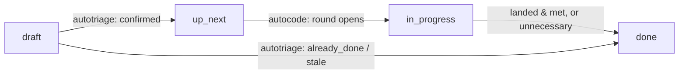

# Backlog System

Markdown kanban at `~/obsidian/backlog/`, read and written by the
[[tools|MCP tools server]], the Mission Control board, the guardian, and the
unattended triage/implement loop. 828 tasks today: 816 on the `lloyd` board, 7
`alfie` (robot firmware), 2 `personal`, and one each on `Architecture`,
`backlog` and `default`. The directory holds one more markdown file than that
— `verdict-log-2026-09.md` — and every reader skips it, because what makes a
file a task is the numeric id prefix on its **name**, not anything inside it.

The file **is** the record. There is no database, no index that has to be kept
in sync, and no writer that holds state between calls — every reader globs the
directory and parses frontmatter. That is what makes the board survivable: a
task is diffable, greppable, restorable from a tarball, and editable by hand
in Obsidian while four programs are writing to it.

## Storage

- **Path:** `~/obsidian/backlog/{id}-{slug}.md`, flat — no board subdirectories.
- **Id:** parsed from the **filename** (`^(\d+)[-_].*\.md$`), not the
  frontmatter. A create takes `max(existing ids) + 1`. 188 legacy files still
  carry an `id:` key; no current writer emits one — `agent_mcp/backlog.py::save_task`
  explicitly drops `id`, `filename` and `body` before dumping the frontmatter.
- **Slug:** generated once from the name at creation (lowercased, every
  non-alphanumeric run collapsed to `-`, truncated to 50 chars) and never
  changes on rename.
- **Title:** the body's first `# ` heading. Also not frontmatter — a rename
  rewrites that heading in place and leaves the filename alone, which is why
  the slug and the title drift apart on old items.
- **Body:** markdown. The loop appends whole sections to it (`## Automod triage
  — <date>`, `## Automod landed — <date>`, `## Merged finding — <date>`,
  `## Findings (round …)`), so an item's body is its own history.
- **Search:** a qmd collection, `backlog` (below).

## Status: four words, one definition



`app/backlog_status.py` is the vocabulary, and it is a shared module rather
than five agreeing literals for a reason. Five lists name a task's status —
`scripts/automod/backlog.py` for the loop, `agent_mcp/backlog.py` for the
`backlog_*` tools, `app/routers/backlog.py` for the Mission Control writer,
`app/routers/dashboard.py` for the board's counters, and `STATUSES` in the
React `BacklogPage` — and they all agreed on the four words, so **drift
between them was never the bug**.

The bug was that none of them had a case for a value *outside* the four, and
the two halves then disagreed in the worst possible direction:
`dashboard._BACKLOG_CLOSED` counted such an item as open work, while
`OPEN_STATUSES` could not see it at all. Nothing could move it either —
`set_status` and `reconcile_statuses` both reach items through `open_items`,
which filters *on status*, so the pass that exists to correct a status is
structurally unable to reach the one status that is wrong in this particular
way. #287 (`review`) and #304 (`closed`) sat in that gap from April 2026 until
2026-09-09, stranded when the vocabulary was narrowed to four words and
nothing migrated what was already on disk.

- `PIPELINE_STATUSES` — `draft`, `up_next`, `in_progress`, `done`. Live counts:
  418 / 25 / 8 / 377.
- `CLOSED_ALIASES` — `closed`, `cancelled`, `wontfix`. Exactly the non-`done`
  members of the set `dashboard._BACKLOG_CLOSED` has carried all along, which
  is the tree's only record that those words ever meant anything. Inventing
  more would be guessing at which of them are terminal.
- `canonical_status(value)` maps anything onto one of the four; case- and
  whitespace-insensitive, because `Done` is a human writing the same word
  rather than a new one. Empty or missing is `draft`.
- `is_off_vocabulary(value)` is deliberately **case-sensitive**, unlike
  `canonical_status`: `status: Done` strands exactly as `status: review` does,
  since no reader lowercases. An *absent* status is not off-vocabulary at all —
  every reader already defaults it to `draft`, so the two halves agree and
  there is nothing on disk to correct.

`backlog.rescue_off_vocabulary` walks by **board** rather than by status (it
uses `all_items`, the one reader that ignores `OPEN_STATUSES`) and runs at the
top of every reconcile, before the main pass, so a rescued item is judged in
that same pass. The mapping is deliberately lopsided: only the legacy words
already known to be terminal reach `done`, and everything else becomes
`draft`. Calling a word terminal when it is not buries a live item where
nothing will look again; calling it live when it is not costs one triage run
that closes it. Pinned by `tests/test_backlog_status_vocabulary.py`.

## The pipeline writes the status; the ledger decides it

Until 2026-09-09 `status` was written in exactly two places, both `done`. A
`confirmed` verdict left an item wherever it was, no round ever set
`in_progress`, and #353 landed while still `draft`.

Now `autotriage` reads **`draft`** only and `autocode` reads **`up_next`**
only. Every other transition is derived rather than scattered:
`backlog.desired_statuses` computes what each open item's status *should* be
from the automod ledger, and `reconcile_statuses` writes the differences — on
every implement poll and after every turn. One table, so the migration of the
existing board and the steady state are the same code. Two rules keep it from
fighting a human: `done` is terminal for this writer, and the loop rewrites
only a status it has a ledger opinion about. The one exception is an untriaged
item parked in `up_next`, where nothing can pull it from — that goes back to
`draft`, where triage looks.

`architecture/automod.md` §3.2a–3.2c is the long version: the outcome
classes, what re-offers an item, and what closes it. What belongs here is the
part that is true of the board itself — an item's status is a claim about
where it is in that pipeline, and any other word is a bug rather than a
dialect.

## Frontmatter

Written by four programs and by hand, so every reader is defensive. What is
actually on disk:

| Field | Type | Notes |
|---|---|---|
| `status` | enum | `draft` \| `up_next` \| `in_progress` \| `done`. See above. |
| `board` | string | The board's **name** is its identity. `lloyd` is Lloyd's own. |
| `priority` | enum | `none` \| `low` \| `medium` \| `high`. MCP creates default `medium`, the HTTP route defaults `none`. |
| `tags` | list | Coerced through `app/backlog_tags.py::normalize_tags` — see below. |
| `blocked` / `assigned` | bool | Free-text filters on `backlog_tasks`; no machine acts on them. |
| `created` / `updated` | ISO datetime | `updated` is stamped by every writer. |
| `completed` | ISO datetime | Written when a writer sets `done`. |
| `position` | int | `id * 1000` at creation; the board's manual ordering. |
| `type` / `segment` | string | Both `backlog`. OKF conformance — see below. |
| `activity_log` | list | The audit trail. See "The activity log". |
| `parent` | int | The item this one was split from or found while implementing. Persisted from the prose first line by the clustering pass. 291 items. |
| `group` | int | The umbrella a member was folded into (tag `grouped`). 60 items. |
| `members` | list[int] | The items an umbrella consolidates (tag `umbrella`). 19 items. |
| `duplicate_of` | int | Written by a group triage's `duplicate_of` verdict. |
| `acceptance_clauses` | list | The contract the review rung holds a round to, on the item and not only in the ledger — a human editing them here is editing what the grader enforces. |
| `human_clauses` | list | What a person must do before the item closes. Kept apart so no round is asked to fake an audit. |
| `clause_amendments` | list | Pending clause rewrites, ratified or refused by the next review. |
| `automod_landed` | sha | The commit that landed it. Legacy spellings `autoimplement_landed`, `selfmod_landed` are still read; only the new one is written. |
| `autotriage_retired` | verdict | Why triage closed it. Legacy `selfmod_retired` on 33 items. |

**None of these is a status**, and the relation keys are the ones most often
mistaken for one: a folded member is `draft` with a `group`, not a fifth state.

Two fields the table deliberately does not list, because nothing writes them:
`id` (filename only, 188 legacy copies) and `name` (the title lives in the body
heading; 33 old items carry a `title:`). The dashboard's `recent_open` list
reads `fm.get("name") or path.stem`, so those rows show the filename stem —
harmless, and worth knowing before reading it as corruption. `due_date`/`due`
are read by `app/routers/backlog.py` and appear on zero items.

### Tags are a list of strings, however they arrive

`app/backlog_tags.py::normalize_tags` is one definition shared by four readers,
because frontmatter is written by models and by hand and `tags` arrives in
every shape YAML can express — a block list, an inline list, a bare word, and
a *string that merely looks like a list*:

```yaml
tags: '[youtube-eval, ai-engineer, eval, retrieval, memory]'
```

That last one is not cosmetic, because every reader degrades differently and
none of them says so: `BacklogPage`'s `task.tags.map` throws and blanks the
whole board for one bad row; iterating the string yields 47 single-character
tags, so `is_quarantined` — the gate that keeps the triage queue from doubling
— silently stops matching; and wrapping the string in a list reads as a fix
while making `tag="youtube-eval"` match none of the items that carry it. Order
is preserved and duplicates dropped, since the tag is the React key.

It lives in `app/` and imports only the standard library, like
`app/backlog_status.py`, so the automod CLI does not pull `mcp` and `httpx` in
behind a fifteen-line helper. `tests/test_backlog_tags_shape.py` pins it.

### The tags the loop writes on itself

| Tag | Meaning |
|---|---|
| `spawned-by-triage` / `spawned-by-autocode` | This loop filed this item. Two earlier spellings — `spawned-by-autoimplement`, `spawned-by-selfmod` — are still **read** (`SPAWN_TAGS`), because quarantine that stopped recognising an old tag would re-admit every item carrying it to the triage pool at once. Write the newest. |
| `umbrella` | A consolidation item that carries `members`. Never merged by write-time dedupe. |
| `grouped` | Folded into an umbrella; out of both pools until that umbrella lands. |
| `blocker` | The one finding an implement round may still file as its own item. Never merged. |
| `needs-human` | A spent attempt, or a landing whose `human_clauses` are outstanding. `draft` is 250 items deep, so the tag is what makes a decision findable. It comes off when a reopen moves the item back into a pool. |
| `expired` | Closed by `expire_stale_spawns`. A human setting the status back to `draft` reopens it. |

**Quarantine.** `backlog.is_quarantined` holds a self-filed item out of the
single-item triage pool. The reason is not that re-triage is wasteful (it is —
a 90-turn session to re-confirm what the previous session proved); it is that
`select_candidate` reads open items and `OPEN_STATUSES` includes `draft`, the
status `backlog_write_task` writes, so **every item triage filed re-entered the
queue it came out of**. Measured over the loop's first 48 hours: 40 triage runs
closed 28 items and filed 78, a reproduction number of **1.95**. The open board
went 19 → 122, and 110 of the 122 were the loop's own output. No cap on spawns
per run fixes that shape; only cutting the edge does.

**Age no longer releases it.** The first cut let a spawned item back in at 30
days, and by 2026-09-11 that was 291 items due to re-enter triage in October,
each spawning ~2 more. The exits now are the ones that do not re-enter the
queue they came out of (`released_ids`): **expiry**, and a group triage `keep`.
`expire_stale_spawns` closes a self-filed `draft` that nothing triaged,
implemented, clustered or tagged in `SPAWN_TRIAGE_MIN_AGE_DAYS` (30) — `done`,
tagged `expired`, text kept — and never an item carrying `EXPIRY_EXEMPT_TAGS`
(`grouped`, `umbrella`, `needs-human`, `expired`). The gate keys on the spawn
tags and **not** on `draft`, which is the status of most of a stale backlog: a
rule that expired drafts would switch the board off rather than bound it.

`triage_pool` returns the held count alongside the candidates, so a pass with
nothing to do can say *which* nothing it means. "Every open backlog item has
been triaged" was true, and misleading, on a board of 122 where 106 were this
loop's own drafts. `tests/test_backlog_spawn_loop.py` pins it, including the
counterfactual: with the spawn tags unrecognised, the same run grows the queue.

## The activity log

Every writer appends one line to the **`activity_log` frontmatter list**:

```yaml
activity_log:
- '**2026-09-11T11:15:08.481354** — Updated: name, description, status to draft'
- '**2026-09-11T18:15:59.460088** — autotriage: **confirmed**. …'
- '**2026-09-11T21:25:36.823760** — up_next → in_progress: automod round starting'
```

A status move records its reason in that line (`_apply_status` writes
`old → new: why`), which is the whole point: an item closed as stale with no
stated reason is indistinguishable from one closed by mistake, and the value of
an unattended pass is that a human can audit it later.

**Until early 2026 this was a `## Activity Log` section at the bottom of the
body**, with lines like `- **2026-03-08 18:05** — Moved to in_review (Lloyd)`.
204 files still carry that section and the vocabulary it was written in; the
newest is #263. No live backlog reader or writer touches it — it is inert text
in the body now. The heading form survives for a different file type
altogether: `autonomy.py::_append_activity_log` and `agent_mcp/autonomy.py`
still append to a `## Activity Log` heading in `~/obsidian/autonomy/*.md`,
which is where a reader coming from an old description of this system will
find the parser they were looking for.

## Malformed YAML degrades, but never round-trips

Three items on the lloyd board have an `activity_log` entry with an
unterminated quote. A strict `yaml.safe_load` raises, every caller here wraps
its parse in `except Exception: continue`, and those items vanish from the
listing *and* from the board's task count with nothing logged.

`agent_mcp/_shared.py::parse_frontmatter_text` is the graduated recovery all
three parsers use: plain parse, then a retry after repairing the known
orphaned-tags corruption, then a regex extraction of a short list of
`fallback_fields`, marking the result `_yaml_broken: True`. It never raises and
never returns `None` — a record may come back degraded, but it cannot silently
disappear.

The other half is that a degraded record is fine to **show** and not fine to
**write**. The fallback only recovers the listed fields, so dumping it back
would write `_yaml_broken: true` into the file and drop every key it could not
read — `activity_log` and the timestamps among them.
`agent_mcp/backlog.py::save_task` returns False, `app/routers/backlog.py::_reject_broken_fm`
raises 409, and `scripts/automod/backlog.py::update_frontmatter` refuses a file
whose frontmatter parsed empty for the same reason.

## MCP tools (4)

| Tool | Description |
|---|---|
| `backlog_boards` | Board names with a task count each. Find a board name before filtering. |
| `backlog_tasks` | List/filter by `status`, `board`, `tag`, `blocked`, `assigned`. Title-only rows — **no text search**. |
| `backlog_get_task` | One task in full: frontmatter, tags, body, activity log. |
| `backlog_write_task` | Create or update. `task_id` to update, omit to create. |

`backlog_write_task` is the one with rules worth knowing:

- **`name`/`description`/`board` are required only on create**, and are
  enforced in the handler rather than in the schema. Declaring them `required`
  in the inputSchema made every *update* fail validation before reaching the
  handler — "'board' is a required property" — which is what broke autonomy
  task #35's daily triage: a 904 s run that promoted nothing and reported
  nothing.
- **`description` appends by default.** `description_mode` takes `append`
  (default), `replace` or `prepend`; `replace` preserves the existing `#`
  heading when the new text does not carry its own.
- **`tags` replaces the list wholesale**, and `status` is validated against the
  four words.
- Every create returns `similar`, and a spawn-tagged create may come back with
  `merged_into` instead of a new id — see below.

See [[tools]] for the full parameter list. The `Tools` page and
`data/tool_overrides.yaml` are how they are switched off.

## Write-time dedupe: check the board before writing

The triage prompt used to say "run `backlog_tasks` first to be sure no item
already covers it" — a tool with no text search returning ~800 title-only rows,
so the check was a ritual. The loop filed the same finding again every time a
round re-ran: #549 ran four times in 110 minutes and filed #788, #795 and #799
for one dead config floor.

`agent_mcp/backlog_similar.py` runs on **every create**. Two legs, and the
second is mandatory:

- **lexical** — token Jaccard over the title and first few hundred characters of
  every item on disk, with a small stoplist. Reads disk, so it sees an item
  written one second ago. Sub-100 ms for 800 files, deliberately Python over
  the file heads rather than an index that has to be kept in sync.
- **semantic** — the qmd daemon's reranked vector search over the `backlog`
  collection it already embeds. Returns `None` (not `[]`) on any failure,
  because the caller must be able to tell "no neighbours" from "no daemon" —
  only the first is evidence.

Two merge rules, both requiring the target to be **open**:

- **Rule A** — reranker score ≥ `threshold` **and** the lexical leg agrees. The
  score alone never merges: measured 2026-09-11, a verbatim title scores its own
  item 1.0 and the nearest distinct neighbour 0.55–0.60, but an unrelated query
  still put **0.75** on its top hit.
- **Rule B** — a strong lexical match on an item created inside
  `recent_window_seconds`. This covers the qmd watcher's debounce: the daemon
  cannot have embedded a file written seconds ago, and the only thing that
  matches a seconds-old item that strongly is the same session filing the same
  finding twice.

A create tagged `spawned-by-*` that hits either rule is **appended** to the
existing item under a `## Merged finding` heading — the activity log names the
session, the text is never lost — and the result carries `merged_into` with
that id. A human's write is only ever advised (`similar`). `umbrella` and
`blocker` writes are never merged; `force: true` bypasses. Every decision,
merge or not, is logged to `~/.local/state/lloyd-automod/dedupe.jsonl` so the
threshold can be tuned from data rather than from the three points measured
when it landed.

**It fails open everywhere.** A daemon that is down, a malformed row, a missing
config block, an unwritable merge target — each costs the advisory list or the
merge, never the write; the finding must land somewhere.

```yaml
backlog:
  dedupe:
    enabled: true
    merge: true          # false = observation mode: compute `similar`, never merge
    threshold: 0.78      # reranker floor for rule A
    lexical_min: 0.4     # jaccard floor (either this or shared_min)
    shared_min: 4        # shared-token floor
    recent_lexical_min: 0.6
    recent_window_seconds: 600
```

`timeout_seconds` (5.0), `limit` (5), `head_bytes` (2048) and `body_chars`
(600) keep their module defaults and are not in `config.yaml`.
`tests/test_backlog_dedupe.py` pins the rules, the fail-open behaviour, and
that a merge never loses text.

## HTTP routes

| Route | Purpose |
|---|---|
| `GET /api/backlog/boards` | Board list with counts, icons and colours for the board tabs. |
| `GET /api/backlog/tasks` | Rows for the board, optionally filtered by `board_id`/`status`. |
| `POST /api/backlog/task-update` | Move, rename, retag, re-board. |
| `POST /api/backlog/task-create` | The UI's create — and the guardian's. |
| `POST /api/backlog/task-delete` | Unlink the file. The only destructive path. |

**The board's name is its identity and `board_id` is a compatibility path.** An
id is positional over `sorted(names)` — `_backlog_board_map` assigns `idx + 1`
— so it renumbers whenever a board appears or vanishes, and a board vanishes
exactly when its last task is moved off it, which the task modal does in one
click. A browser tab holding a board list from thirty seconds ago then sends an
id that is still *valid*, for a different board, and the item moves somewhere
nobody asked for. An unresolvable id on update used to fall back to the task's
current board and return success — a move the user asked for that silently did
not happen, which is the one outcome worse than an error. It is a 400 now, like
an invalid status. Create keeps the silent `default` fallback, since a create
with no resolvable board still has to land somewhere.
`tests/test_backlog_board_move.py` pins it.

`agent-services/guardian/notify.py::_backlog_task` POSTs to `task-create` after
a rollback, which makes this route a second live writer beside the MCP one. Its
field names must match (`name`/`description`/`status`/`priority`, **not**
title/body): sending the wrong keys does not error — the endpoint defaults
`name` to "New Task" and returns 2xx — so the alert would read as delivered
while filing a task that says nothing. It checks the returned name for exactly
that reason.

## OKF conformance at birth

OKF v0.1 requires one thing of a concept document: parseable frontmatter with a
non-empty `type` (`scripts/vault/validate_okf.py`). Neither live create path
declared one, so every task was a violation the moment it hit disk and the
nightly OKF count could only climb (#518). Both writers now stamp
`type: backlog` / `segment: backlog` on create, and only on create — updating a
legacy file still does not backfill a type it never had, because
`backlog_task_update` and `save_task` only round-trip keys that are already
there. `tests/test_backlog_okf_frontmatter.py` pins both writers.

## QMD integration

- **Collection:** `backlog` → `/home/alansrobotlab/obsidian/backlog`, pattern
  `**/*.md`, in `~/.config/qmd/index.yml`.
- The directory is *also* inside the whole-vault `subliminal` collection, which
  is how backlog items reach pre-call context retrieval — see [[subliminal]].
- **Reachable from:** `vault_search` and `vault_recall`, which fan out over
  `VAULT_SEGMENTS` in `agent_mcp/vault.py` — `backlog` is one of the eleven, so
  `scope: "backlog"` restricts a search to the board. `backlog_similar` queries
  the same collection directly with `rerank: true`, and
  `scripts/automod/cluster.py` reads the chunk-0 vectors qmd has already stored
  for it rather than embedding anything itself.
- The tools named in the migration note below — `mem_search` and
  `context_bundle` — no longer exist; they were the retrieval surface in March
  2026 and were replaced by the five `vault_*` tools.

## Who counts the board

`app/routers/dashboard.py::_backlog` produces the Mission Control counters:
totals by status and by board, plus `umbrellas`, `grouped` and `recent_open`.
It is TTL-cached for 10 s — the board is 800+ markdown files and its status
counts do not change between 2-second polls.

**Front matter is bounded by its closing `---`, not by a byte count.**
`_frontmatter` reads in 4 KB chunks up to a 64 KB ceiling and stops at a
line-anchored `^---$`. The previous flat 3000-byte prefix silently dropped five
backlog items, and the selection was causal rather than random: an item grows
its `activity_log` precisely by being worked on, so the two it hid were the two
that were `in_progress` — the board reported zero. A cap that hides whatever is
most active is the worst possible reading of "bounded".

## Access rules

- Lloyd queries the backlog directly through the MCP tools — never from
  vault memory or a summary, which may be stale.
- Every status move is attributed in the activity log and carries its reason.
  Tag-only writes (`tag_item`) move `updated` and nothing else, so a tag is the
  one change the log does not narrate.
- All operations are file-based. Concurrency is "last writer wins on a whole
  file", which is survivable only because writes are small, rare and
  append-shaped — and because nothing rewrites a file it could not parse.

## Migration history

### Phase 1–2: SQLite → markdown (#220, March 2026)

Migrated from a SQLite database (`~/.openclaw/data/backlog.db`) to markdown
files. The database was opaque, unsearchable by the memory tools, invisible in
the vault and not version-controlled. Decisions locked at the time, and still
true: flat `{id}-{slug}.md`, numeric ids kept, slug generated once, boards as a
frontmatter field rather than directories, all four MCP tools kept with
identical interfaces and their internals rewritten to file operations, and a
new `backlog` qmd collection. One decision has since been reversed — the
activity log was specified as "inline append section at bottom of each file"
and is now the `activity_log` frontmatter list (see above).

### Previous system

Before that, the backlog was a Rails 8 app (Clawdeck) at
`~/Development/clawdeck/` on port 3001, backed by PostgreSQL. Neither that tree
nor `~/.openclaw/` exists on this machine any more; the record of both survives
in #220 and in the vault's 2026-03 daily notes.

## Related docs

- [[index]] — architecture index
- [[tools]] — the lloyd-mcp aggregator and the full tool definitions
- [[automod]] — the triage/implement loop that reads and writes this board
- [[subliminal]] — pre-call retrieval, which sees backlog items
- [[infrastructure]] — services and processes
