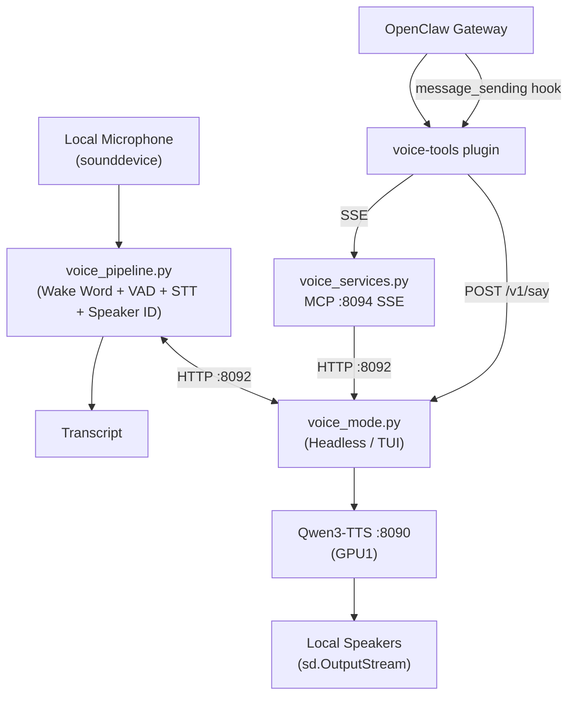
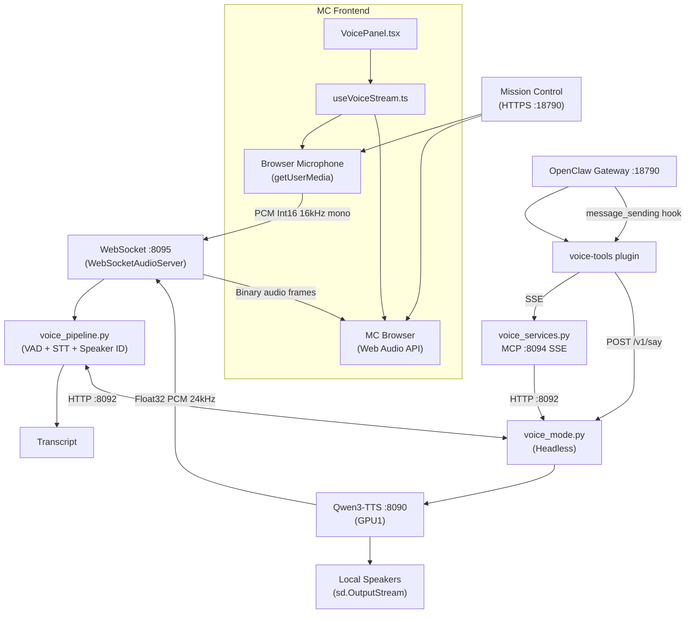

# Voice Pipeline

Self-contained voice processing pipeline for wake word detection,speech recognition,text-to-speech,and speaker identification. All source code lives at `~/Projects/lloyd-services/`.

Two-file architecture: `voice_pipeline.py` handles audio processing,`voice_mode.py` handles orchestration and the HTTP API.

Supports two input modes: **local microphone** (default) and **browser WebSocket** (Mission Control).

## Architecture -- Local Mic Mode (`input_mode: local`)

## Architecture -- Browser WebSocket Mode (`input_mode: websocket`)

## Webhook Integration

When a transcript is recognized,`voice_mode.py` forwards it to the OpenClaw gateway via a webhook POST to `/hooks/wake`. This triggers a new conversation turn with the transcribed text.

## Components

### voice_pipeline.py -- Core Processing

The main audio processing pipeline.

- **Wake word detection:** openWakeWord (custom-trained "Hey Lloyd" / "Lloyd")
- **VAD:** Silero VAD (512-sample frames at 16kHz)
- **STT/ASR:** Whisper via onnxruntime-gpu
- **Speaker identification:** Resemblyzer + enrolled voice profiles
- **Pipeline states:** IDLE -> LISTENING -> PROCESSING -> IDLE (+ SPEAKING for TTS)
- **Wakeword ring buffer:** 3 seconds of audio
- **Silence detection:** 1000ms threshold
- **Minimum utterance:** 0.3 seconds
- **GPU:** ONNX Runtime with CUDA support (pre-loads NVIDIA CUDA 12 libs)

#### Audio Reader Abstraction

Pipeline functions accept a `reader_factory` parameter for swappable audio sources:
- `_AudioReader` -- wraps `_SafeMicStream` (sounddevice callback API,avoids Pa_ReadStream heap corruption)
- `_WebSocketAudioReader` -- pulls frames from `WebSocketAudioServer.frame_queue`

Both implement: `read(timeout) -> np.ndarray | None`,context manager protocol.

#### WebSocketAudioServer

- Runs in a background thread with its own asyncio event loop
- `send_message(dict)` -- thread-safe JSON push to browser
- `send_binary(bytes)` -- thread-safe binary push (TTS audio)
- `make_reader()` -- creates a `_WebSocketAudioReader` (drains stale frames first)
- `has_client` -- whether a browser is connected

### voice_mode.py -- Orchestration / HTTP API

Headless mode for supervisord operation (also supports Textual TUI). Exposes HTTP API on port 8092.

| Endpoint | Method | Purpose |
|----------|--------|---------|
| `/v1/status` | GET | Pipeline state,last transcript,speakers |
| `/v1/say` | POST | TTS playback (local speakers + browser if connected) |
| `/v1/voice/toggle` | POST | Enable/disable voice |
| `/v1/voice/ws-status` | GET | WebSocket input mode status and port |

Forwards transcripts to the gateway via webhook POST to `/hooks/wake`.

### voice_services.py -- Voice MCP Server

- **Framework:** FastMCP on port 8094 (SSE transport)
- **Supervisord service:** `lloyd-voice-mcp` (inside distrobox `lloyd-services`)
- **Command:** `uv run voice_services.py --transport sse --port 8094`
- **Role:** Proxies tool calls to the voice HTTP API (port 8092)
- **Tools:** `voice_status`,`voice_last_utterance`,`voice_enroll_speaker`,`voice_list_speakers`
- **