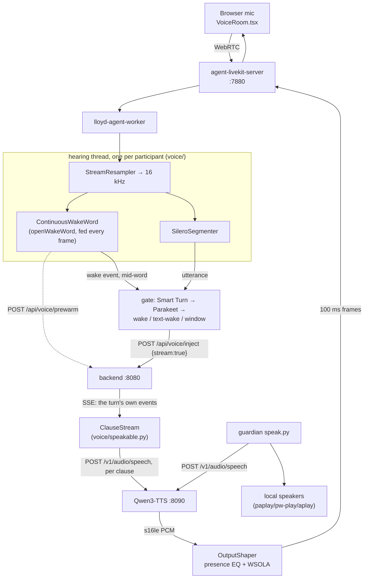

# Voice

Talking to Lloyd out loud, and Lloyd talking back. This is the whole round
trip in one place: the LiveKit transport, the hearing pipeline (VAD, wake word,
end-of-turn, ASR), the gate that decides whether an utterance becomes a turn,
the reply spoken while it streams, the cloned TTS voice, and the two
corrections applied to it on the way out. Where a piece has a setup story — a
model file on disk, a vendored upstream, a secret — that story is here too, and
[[infrastructure]] / `SETUP.md` carry only the pointer.

One agent worker (`lloyd-agent-worker`) sits in a LiveKit room with the
browser, turns what it hears into an ordinary user turn on a chat session, and
speaks the reply back — clause by clause as the model writes it — in a voice it
corrects client-side.

**The hearing and speaking halves were rebuilt on 2026-09-17** after a review
measured the old ones: the wake word had fired 5 times in 949 utterances, an
energy VAD was discarding normal-volume speech, Whisper `base.en` took longer
on shorter clips, and a reply was not spoken until it had been finished,
rewritten by a second model and found by a 500 ms transcript poll. "The
2026-09-17 rework" below is the account; the measurements that decided each
piece are in it, and `scripts/voice/` reproduces them.

## The round trip

Five processes, and the browser makes six. Only the hearing and shaping
stages share an address space; every hop between the boxes below is a socket,
which is why each half can be restarted, or break, on its own.

| Process | Port | Role | Launcher |
|---|---|---|---|
| `agent-livekit-server` | 7880 (+7881 TCP, 50000–50100 UDP) | the LiveKit SFU binary. Never reads TTS config | `agent-services/bin/start-livekit-server.sh` |
| `lloyd-agent-worker` | 8501 (loopback, diag only) | `agent-services/livekit_worker.py` + `agent-services/voice/` — hearing, the gate, streaming TTS | supervisord runs it directly |
| `agent-tts` | 8090 | Qwen3-TTS, OpenAI-shaped `/v1/audio/speech` | `agent-services/bin/start-qwen3-tts.sh` |
| `lloyd-mc:lloyd-backend` | 8080 | `/api/voice/*`, `/api/livekit/token`, the turn itself | `server.py` |
| `lloyd-mc:lloyd-frontend` | 5173 | Vite: proxies `/api` to the backend and `/livekit` to the SFU | `npm --prefix web run dev` |

Both the worker and the TTS engine are pinned to **GPU 0** (the desktop 3090)
by `CUDA_VISIBLE_DEVICES` in their supervisord programs — see
[[infrastructure]] for why the worker must stay off GPU 1. Every model the
worker runs is CPU ONNX: Silero VAD, openWakeWord, Smart Turn, Parakeet (via
sherpa-onnx) and the CAM++ speaker encoder (onnxruntime). The worker's VRAM is a dependency initialising a
CUDA context, not a model.



End to end, one utterance:

1. The browser mints a room-scoped JWT from `POST /api/livekit/token` and joins
   `lloyd-<session_id>` over WebRTC.
2. `WorkerManager` sees a room with a non-agent participant within 2 s and
   opens a `RoomBridge` on it. Each participant's audio gets its own
   `HearingThread`, which runs a `HearingPipeline` off the event loop.
3. Every frame is resampled once to 16 kHz and fed to the wake word and to
   Silero. The wake word fires **while the word is being said**; the worker
   opens the window, pushes `wake_state: listening` to the browser and asks the
   backend to prewarm the session's prompt, all before the sentence ends.
4. Silero closes the utterance after 380 ms of silence. Smart Turn decides
   whether it is a finished thought (if not, it is held and joined to what
   follows); Parakeet transcribes it in ~60 ms.
5. The gate decides: wake detected in it, or a transcript that opens with a
   wake phrase, or the locked speaker's continuation window. What survives is
   POSTed to `/api/voice/inject` with `stream: true`.
6. The backend enqueues an ordinary user turn — with a voice reminder in the
   prompt's tail and thinking off — and streams that turn's own events back.
7. The worker cuts the streamed text into clauses and sends each to TTS the
   moment it is complete; `OutputShaper` corrects the audio and 100 ms frames go
   out on the `lloyd-tts` track while the model is still writing.

## LiveKit: the transport

### Rooms are sessions

`WorkerManager` polls LiveKit's RoomService every `POLL_INTERVAL` (2 s) and
joins any room whose name starts with `livekit.room_prefix` (`lloyd-`) and
which has a non-agent participant. The room name *is* the routing key: a
`RoomBridge` strips the prefix and treats the remainder as the chat
`session_id`, so `lloyd-20260911_120001_abcd` bridges audio into that session
and nothing else. The browser gets a room-scoped JWT from
`POST /api/livekit/token`, which builds the same name from the same prefix —
the two halves agree because they read one config key, not because anybody
kept them in step.

A bridge is torn down only after `_IDLE_GRACE_SECONDS` (15 s) of zero remote
participants. A participant flickering off and on for a second would otherwise
force an immediate reconnect, and the reconnect is the expensive half.
LiveKit's own `room.empty_timeout` (300 s) then reaps the room itself.

`disconnect` waits up to 8 s on in-flight utterance handlers before dropping
the room, so the last thing said before someone closes the tab still lands in
the session.

### Two URLs, and only one of them is for browsers

`livekit.url` (`ws://127.0.0.1:7880`) is the **worker's** URL and is never
handed to a client. Browsers connect through Vite's `/livekit` proxy, which
terminates TLS and forwards plain ws to loopback — so
`_livekit_url_for_request` builds the client URL from the public host the
browser actually used, reading `X-Forwarded-Host` / `X-Forwarded-Proto` that
Vite sets (`xfwd: true`). An explicit `livekit.client_url` still wins for
setups that need it.

The proxy entry needs `ws: true` or the upgrade dies at the Vite layer with
nothing in the backend's log.

### The ICE address is resolved at boot, and must never be hardcoded

LiveKit binds its media ports to `rtc.node_ip`, and a stale value does not
error — the bind silently fails, no media sockets exist, every ICE negotiation
times out in `wait_pc_connection`, the agent never hears anything, and voice is
simply dead. That is exactly what the 08-22 box migration did: the tailnet
reassigned the host from `100.72.151.100` to `100.105.113.88` and LiveKit went
on advertising an address the machine no longer owned.

So `agent-services/conf/livekit.yaml` carries `node_ip: ${LIVEKIT_NODE_IP}` and
`start-livekit-server.sh` resolves it at every boot — `tailscale ip -4` first,
the default-route source address as a fallback — then renders the template
through `envsubst` into `livekit.yaml.runtime` (chmod 600, gitignored) and
execs the binary against that. It downloads the binary itself on first run
(`LIVEKIT_VERSION`, currently 1.11.0, to `~/.local/bin/livekit-server`).

Pinning the candidate to the Tailscale address is what makes remote voice work
from anywhere on the tailnet. The accepted trade-off is that a LAN client with
no Tailscale cannot use voice at all.

### Tokens and secrets

`POST /api/livekit/token` takes a `session_id`, builds the room name, and mints
a JWT with `room_join`, `can_publish`, `can_subscribe` and `can_publish_data`
scoped to that one room — the data grant is what carries the interrupt button
and `client_info`. Identity defaults to a fresh uuid, and *one browser tab is
one identity*, which the continuation gate then leans on.

`LIVEKIT_API_KEY` / `LIVEKIT_API_SECRET` live in `.env` (gitignored) and reach
config.yaml through `${VAR}` placeholders. The start script parses them out of
`.env` by hand rather than sourcing it — other entries contain spaces and would
not survive `source`. Rotate with `bash scripts/gen-livekit-secrets.sh`; the
backend answers 503 rather than minting an unsigned token when they are absent.

## Hearing

`agent-services/voice/` is the whole of it, and none of it imports LiveKit or
the worker — so every stage can be driven from a WAV. That is the point of the
split: the pipeline it replaced lived inline in `RoomBridge`, could not be
built without a room, and was observable only through its log, which is how
5 wake fires in 949 utterances went unnoticed for three weeks.

| Module | Stage |
|---|---|
| `resample.py` | `StreamResampler`: one stateful resample to 16 kHz, shared by every model |
| `wake.py` | `ContinuousWakeWord`, `WakeWordFactory`: openWakeWord fed continuously |
| `vad.py` | `SileroSegmenter`: speech, not energy |
| `turn.py` | `SmartTurn`: "was that a finished thought?" |
| `asr.py` | `SherpaOfflineRecognizer` (Parakeet), `WhisperRecognizer`, `SherpaStreamingRecognizer` |
| `pipeline.py` | `HearingPipeline`: owns one stream's clock and emits `HearingEvent`s |
| `runner.py` | `HearingThread`: one per participant, off the event loop |
| `speakable.py` | `ClauseStream`: the speaking half's text segmenter (below) |

### One stream, one clock, one thread

Everything in the pipeline holds per-stream state — the resampler's filter
history, Silero's recurrent state, openWakeWord's feature window — so a
`HearingPipeline` is per participant and never shared. Every index it reports
is 16 kHz samples since the stream opened, which is how a wake detection
(stamped by a model that reads 1280-sample frames) is attached to an utterance
(closed by one that reads 512).

It runs on its own thread, fed by an unbounded queue, and posts events back
with `call_soon_threadsafe`. The pipeline costs ~6% of a core per participant
but arrives as a spike every eighth frame, on the loop that paces TTS frames
into LiveKit; and `asyncio.to_thread` per 10 ms frame would be a hundred
handoffs a second. The queue never drops audio, because a bounded one that did
would reintroduce the silent gaps this work removes.

**The resampler guards both edges.** `resample_poly` zero-pads each end of
whatever it is handed. The first cut only prepended history and still emitted
the tail — 6.7e-2 peak error against the one-shot result, audible, and
invisible to anything but `test_streaming_matches_one_shot`, which now pins it
to 1e-6. It holds the last filter-length of input back until it has right-hand
support: 2.7 ms of delay at 48 kHz.

### Segmentation: Silero, not an energy threshold

The energy VAD was the root cause of voice barely working. Its `speech_rms`
was 0.025 and every wake-word utterance in the diagnostic corpus measured
`rms_mean` 0.013–0.017 — normal speech at a normal distance sat below the
speech threshold, so only the loudest syllables crossed it and sentences
arrived as fragments with the quiet parts missing. No threshold could fix it:
loudness is the wrong quantity. Silero asks whether the sound is speech;
measured here its mean speech probability held at 0.87–0.89 across a 16×
attenuation, and it costs 0.14 ms per 32 ms frame.

`livekit.vad`: `threshold` 0.45 (a false positive is cheap now — the gate
decides — and a false negative is a sentence never heard), `min_silence_ms`
380, `speech_pad_ms` 220 of pre-roll, `min_utterance_ms` 250,
`max_utterance_ms` 30000. The old `min_voiced_ratio` is gone: Silero's
probability *is* the voicing measure, and a second one on top dropped 208
utterances. A capped utterance continues straight into the next rather than
waiting for a fresh onset, so the word after the cap survives; a participant
who leaves mid-sentence has it flushed.

### The acoustic wake word, fed continuously

The old `AcousticWakeWord` waited for the VAD to close an utterance, reset the
model and swept `predict()` across it. That gated the wake word on the very
component dropping the audio, and it shared one stateful `Model` across every
room from a thread pool. Now each stream owns a model fed every frame and
never reset, so the word is heard as it is said:

- **It fires as the word ends**, measured −60 to +20 ms from the last phoneme
  (`test_the_wake_fires_as_the_word_ends_…`). The window opens, the browser
  shows "Listening" and the backend starts prewarming before the sentence is
  finished — 1.8–1.9 s before its end in the end-to-end runs.
- **False accepts fell from 6 to 0** on the 496 non-wake utterances of real
  room audio in the diagnostic corpus, at the production threshold of 0.4
  (`scripts/voice/replay.py compare-wake`). A reset model sees an empty
  feature history, and on that the tail of a word ("…oyd", "go go") scores
  like the whole phrase.
- **Recall roughly doubled** on 48 synthetic wake phrases in six voices: 10
  for the sweep, 17–23 continuous depending on lead-in and level.

A note on what was *not* the problem, because the first version of this doc
claimed it was: `predict()` zeroes its first 5 outputs after a reset, but only
its outputs — the feature buffers keep filling — so a word that starts 200 ms
into a swept clip still scores 0.95. Measure before believing a mechanism.

`WakeWordFactory.validate()` runs at boot and a missing model file is a boot
error, not a warning: the old fallback to text matching is how the worker
stayed silently deaf. It also absorbs openwakeword's 0.4 → 0.6 constructor
change; 0.4.0 is installed and nothing here needs 0.6. `refractory_ms` 1500
stops one "hey Lloyd" opening the window three times (the score stays high for
several frames after the word). The running peak score is reset at each speech
onset, so the `wake_peak` on a drop line describes that utterance.

**The models were the weak link, so `Hey_Lloyd.onnx` was retrained** the same
evening. Even fed continuously, it and `Lloyd.onnx` caught fewer than half of
clean synthetic wake phrases — almost none of "Hi / Okay / Hello Lloyd" — and
scored "Floyd came over" at 0.59. Its replacement, `hey_lloyd.onnx`, is a
livekit-wakeword conv-attention classifier over the same `(16, 96)` embedding
window, so it loaded into the existing runtime with no code change (see
"Retraining the wake word" below). Held-out — ten Qwen3-TTS voices, a different
engine from the Piper voices it was trained on — through the worker's own
runtime (`scripts/voice/wake_eval.py`):

| model set | "hey / hi / okay / hello Lloyd" (60) | bare "Lloyd" (20) | near-misses (80) | real room (496 utts) | LibriSpeech (8 min) |
|---|---|---|---|---|---|
| `Hey_Lloyd` + `Lloyd` @ 0.4 (before) | 16 | 7 | 2 | 0 | 0 |
| `hey_lloyd` + `Lloyd` @ 0.7 (now) | **33** | 5 | **0** | 0 | 0 |

`Lloyd.onnx` stays, for bare "Lloyd…": at 0.7 it adds 5 of 20 of those and no
false accepts on any set, including 24 sentences that merely *mention* Lloyd.
Its training recipe was lost with the old disk; `hey_lloyd.onnx`'s is in the
repo. The threshold rose from 0.4 because the new model's scores sit higher
across the board — at 0.4–0.6 it fired once in the real-room corpus.

**A fire on a mention is not a request.** One mention in 24 fires either way:
"Did Lloyd finish the report?" scored 0.93 on the new model, because "did Lloyd"
sounds like "hi Lloyd". The gate used to inject any acoustically-woken sentence
whose transcript it could not match, trusting the acoustic model over Whisper's
spelling. Parakeet spells the name right, so `_mentions_wake_name` now drops a
woken utterance whose transcript names Lloyd *mid-sentence* ("did Lloyd…", "I
told Lloyd…", "Lloyd's car…") while keeping the name first or last as an
address ("what time is it, Lloyd?"). A transcript with no name in it at all is
still a mishearing, and the acoustic model still wins.

The transcript also carries recall on its own:

### The second wake path: the transcript

`livekit.wake.text_fallback`: an idle utterance the acoustic model did not
claim is transcribed, and wakes Lloyd if the transcript **opens** with a wake
phrase (`_strip_wake_word`, one leading "uh" / "um" / "oh" allowed, never two —
"so I told Lloyd" is the name, not an address). Measured on the same sets:

| wake path | 48 wake phrases, 6 voices | 48 near-misses | 496 real room utterances |
|---|---|---|---|
| acoustic, continuous | 17–23 | 0–1 | 0 |
| transcript opens with a wake phrase | **40** | **0** | **0** |

This was never viable before: it means transcribing every idle utterance, and
Whisper cost 2.76 s a clip. Parakeet costs ~60 ms. The acoustic path stays — it
fires mid-word, the transcript only at utterance end — so the two together are
what `text_fallback: true` means.

### End of turn: Smart Turn

A VAD answers only "has the sound stopped", and every pause inside a sentence
looks like the end of one: the old 500 ms silence both cut people off and cost
every turn half a second. `SmartTurn` (pipecat's Smart Turn v3.2, BSD-2-Clause,
8 MB int8 ONNX: a Whisper-tiny encoder with a linear head over the last 8 s)
turns the trade into a decision. In the window, an utterance it calls
unfinished is **held** and glued to what comes next, so the silence can be 380
ms without sending half a question; `hold_timeout_ms` (2200) releases a held
turn when the speaker simply trails off, and `hold_max_seconds` (12) bounds
how much can accumulate. It fails open — a model that will not load means
"complete", because answering early beats not answering.

Its preprocessing must match pipecat's `inference.py` exactly, since the head
is a linear probe on a frozen encoder: keep the last 8 s, zero-pad to 128000
samples, zero-mean/unit-variance over the *real* samples only, re-zero the
padding, then Whisper's own log-mel — faster-whisper's `FeatureExtractor`,
which is that mel to the line, with `padding=0` for exactly 800 frames. The
check that it is right: a complete question scores 0.976 and the same voice
cut mid-phrase 0.019 (`test_a_finished_question_and_a_cut_phrase_are_told_apart`).
~75 ms on this CPU. It runs only on utterances that already passed the wake
gate or the window, never on idle room audio.

### ASR: Parakeet

`livekit.stt.backend: parakeet` — NeMo Parakeet TDT 0.6B v3, int8, through
sherpa-onnx on 4 CPU threads, no GPU. LibriSpeech validation.clean, 73 clips,
via `scripts/voice/asr_eval.py`:

| | WER clean | WER at 10 dB SNR | RTFx |
|---|---|---|---|
| parakeet | **3.83%** | **9.30%** | 24× |
| whisper base.en (fallback off) | 10.61% | 18.96% | 16× |

On utterance-length audio the gap is wider: a 1 s clip took `base.en` 2.76 s
in production and Parakeet 0.06 s. Whisper was *slower on shorter audio*
(0.57 s for clips over 8 s) because its temperature fallback re-decodes the
whole clip each time a tightened threshold fails, and short utterances are what
fail them. `backend: whisper` remains as the fallback, with
`temperature_fallback: false`, which alone took it from 2.75 s to 0.62 s.
Audio reaches sherpa already at 16 kHz: handed 48 kHz it builds a fresh
resampler per stream and logs a paragraph each time.

#### Names and terms: a second, biased decode

The first real session on Parakeet (2026-09-18) heard "how many items are in
our Lloyd backlog" as "back block". Whisper had been handed
`~/obsidian/hotwords.md` (the family and project names) and Parakeet never
was. Three things made the obvious fix the wrong one:

- **sherpa biases only in beam search, and beam search alone is worse here**:
  LibriSpeech 3.83% → 4.78% clean, and it changes 188 of 500 real-room
  transcripts — mostly silence turned into "Mm." or "Yeah.", which inside a
  follow-up window would be sent to Lloyd as a turn.
- **sherpa will not take hand-split pieces.** Handed `▁back log` it splits at
  the `▁`, logs `Cannot find ID`, skips the word and loads anyway. It needs
  `modeling_unit: bpe` and a sentencepiece vocab to encode words itself; the
  export ships only `tokens.txt`, so `bpe_vocab_from_tokens` rebuilds one
  (pieces in merge order, score `-id`). `test_every_configured_hotword_encodes…`
  fails on that log line.
- **Biasing toward the wake name wakes Lloyd.** With "Lloyd" on the list,
  "Floyd came over yesterday" came out "Lloyd came over yesterday" — a
  transcript that opens with the wake word. The worker excludes every wake-word
  token (`parakeet_hotwords(…, exclude=)`).

So `HotwordRecognizer` runs greedy and a biased beam decode side by side (the
biased one on its own thread) and keeps greedy's transcript unless the biased
one *gained* a word on the list (`prefer_biased`). Measured with
`scripts/voice/hotword_eval.py` on 132 held-out TTS sentences that contain a
hotword and 72 sound-alikes that do not (`synth_hotword_corpus.py`: "the back
lot", "Emily", "stomping", "Floyd"), plus LibriSpeech and the 500 real
utterances:

| the configured list (10 words) | hotword recall | false insertions | LibriSpeech clean / 10 dB | real changed |
|---|---|---|---|---|
| greedy (before) | 87/132 | 0/72 | 3.83% / 9.30% | — |
| beam + list @1.0 | 104/132 | 0/72 | 4.78% / 8.78% | 186/500 |
| **greedy, biased where it gains @1.0** | **106/132** | **0/72** | **3.83% / 9.30%** | **1/500** |

The one real change is "back block" → "backlog". Per word, greedy →
combined: LiveKit 0 → 6 of 6, Stompy 5 → 11 of 12, Alan 5 → 9 of 12, Lisa,
Inner Voice and backlog one more each. With a 13-word list at 1.5 recall
was 110/132 but "the back lot" became "the backlog" for four voices, so 1.0.
autotriage, autocode and Mission Control were tried and did not gain, so
`livekit.stt.hotwords` lists only backlog, LiveKit and Inner Voice; the vault
file is read as it is ("gr00t" does nothing either — the model hears
"group"). The price is
~+100 ms per utterance and a second copy of the model, ~1 GB. The
transcript's `backend` reads `parakeet+hw` when the biased decode was used,
so the diag line says which one spoke. `parakeet_hotwords: false` is the
switch.

`livekit.stt.streaming` (off) runs a cache-aware streaming FastConformer CTC
for live partial transcripts on the data channel (`partial_transcript`).
Nothing consumes a partial at either end yet — `VoiceRoom`'s data handler
returns on any message type but `wake_state` — and the committed transcript is
always the offline recogniser's, so switching this on today buys a 438 MB model
and no visible change. Preemptive generation is the reason to turn it on.

### The gate

`RoomBridge._handle_utterance_event` decides what a closed utterance means.
The wake decision arrives *with* the utterance (`ev.wake`, the detection that
fell inside its span) — the inversion at the heart of the rework, since the
old gate had to ask openWakeWord here, after the VAD had already mangled the
audio.

1. Not woke, not in the window: try the transcript path (above). If it does
   not wake, drop — logged with the VAD probability, the utterance's wake peak
   and the transcript.
2. Smart Turn: hold an unfinished thought (skipped for a transcript wake, whose
   audio is already transcribed and whose request continues in the window).
3. Parakeet on the (possibly joined) audio.
4. Woke: embed the speaker, set the anchor, open the window, publish state.
5. Continuation (not woke): the locked LiveKit identity, and — only when the
   wake-word utterance matched an *enrolled* profile — the voiceprint anchor.
6. Woke: strip the wake phrase; a bare wake opens the window and injects
   nothing; a short unmatched transcript on an acoustic wake is a misheard bare
   wake; a long one is injected as-is, since the acoustic model is the
   authority on whether the word was said.

`WakeState` is IDLE or CONTINUATION as before: a wake opens a
`continuation_seconds` (6 s) window for the locked participant, every
pass-through extends it, and a finished reply reopens it.
`tests/test_voice_gate.py` drives the whole gate with a scripted recogniser.

Note that the code defaults and the config disagree in two places, and
config.yaml wins: `WakeState.continuation_seconds` defaults to 12.0 against the
configured 6.0, and `RoomBridge.anchor_threshold` defaults to 0.65 against the
configured 0.4.

### Who is speaking: profiles and enrollment

`agent-services/speaker_id.py` embeds an utterance into a unit-norm vector —
cosine is a dot product — and does two different jobs with one encoder:

- **Enrolled recognition.** Profiles in `livekit.voiceprint.profiles_dir`
  (`~/lloyd-data/voice_profiles`). `identify()` returns the best profile above
  `profile_threshold` (0.40) or `unknown_label`. That name becomes the
  `[Alan]: …` prefix on the injected turn.
- **Anchor matching** for the continuation window above, against
  `anchor_threshold` (0.25) — a deliberately looser bar, because it is
  answering "same voice as ten seconds ago", not "who is this".

**The encoder is CAM++ since 2026-09-24** (`livekit.voiceprint.backend:
campplus`; `resemblyzer` is the other value). 3D-Speaker's
`speech_campplus_sv_en_voxceleb_16k`, the 28 MB ONNX export sherpa-onnx
publishes, run through onnxruntime on CPU with a numpy Kaldi fbank in front —
no new dependency. `eval/speaker_embed_eval.py` measured it against the old
Resemblyzer GE2E and ReDimNet-B2 (torch, scratch venv) on 1–4 s clips, the
lengths the worker embeds:

| | Resemblyzer | CAM++ | ReDimNet-B2 |
|---|---|---|---|
| clip-to-clip EER, LibriSpeech test-clean (40 spk × 10 crops) | 9.7% | **4.7%** | 4.5% |
| … when the shorter clip is 1 s / 2 s / 4 s | 13.0 / 4.5 / 0.3% | 6.3 / 1.2 / 0.05% | 6.3 / 1.3 / 0% |
| profile (mean of 3 clips) vs clip EER | 4.3% | 2.5% | 1.8% |
| same / different speaker cosine, p5–p95 | 0.57–0.86 / 0.37–0.64 | 0.27–0.76 / −0.07–0.26 | 0.25–0.75 / −0.10–0.23 |
| own voice: Lloyd clone p5 − room p95 (clean / through-the-room) | +0.07 / +0.07 | **+0.31 / +0.18** | +0.17 / +0.06 |
| room corpus pairwise cosine, p5 / p50 / p95 | 0.34 / 0.52 / 0.74 | −0.02 / 0.16 / 0.50 | −0.05 / 0.11 / 0.39 |
| embed, median ms at 1 s / 4 s (2 threads, busy box) | 16 / 39 | 21 / 62 | 26 / 73 |
| runs in the lloyd venv | yes | yes (onnxruntime) | no (torch + torchaudio) |

The plan's 0.65% / 0.57% are VoxCeleb1-O on whole utterances; short
cross-domain crops cost every model the same factor. ReDimNet-B2 is a hair
ahead on LibriSpeech and behind on own-voice separation, and would need an
ONNX export of its torchaudio front end, so CAM++ ships.

- **Own-voice rejection** (Phase 2): 12 renders of `clone:dave_cullen` from the
  live TTS server, a profile from the mean of 5, scored against 21 held-out
  1–4 s windows and the 194 room utterances ≥ 1 s. With CAM++ any threshold in
  0.26–0.44 rejects all 21 clean windows and keeps every room utterance
  (0.26–0.36 for band-limited copies at 15 dB SNR); ~0.30 is the middle of
  both. Resemblyzer's best single threshold rejected 95.2% and kept 95.4%.
  Enrol from several renders: the 5-render mean scores held-out windows at a
  median 0.75, a single render at 0.54.
  The highest room utterances against the clone are "Laughter", "Okay. Okay."
  and "What's the good word?" at 0.24–0.25 — nothing in that corpus is Lloyd.
  21 windows from 7 renders is thin; re-measure through the room before
  trusting the margin on a loudspeaker.
- **The room corpus** (`~/.lloyd/ww_diag`, 500 clips, mostly Alan plus TV) is
  unlabelled, so it measures spread, not accuracy. CAM++ spreads it over
  −0.02–0.50 where Resemblyzer crowded it into 0.34–0.74 — which is why
  Resemblyzer's 0.4 anchor threshold let 89% of different-speaker LibriSpeech
  pairs through.
- **The published export is patched as it loads.** Its 52 `AveragePool`
  nodes carry `count_include_pad=1`, so the partial 100-frame segment at the
  end of every utterance is divided by 100 where PyTorch divides by what is
  there, and the embedding collapses each time an utterance crosses a 2 s
  boundary: 38% EER as published, the same through sherpa-onnx's own
  `SpeakerEmbeddingExtractor`. `_patch_count_include_pad` flips the attribute
  in the model bytes; the file on disk stays the published one, so the fetch
  script's size check holds. WeSpeaker's CAM++_LM export has the same
  collapse by another route and was not pursued.
- **Profiles are tagged by backend**: `<name>.<backend>.npy`. Another
  backend's profile is ignored and logged, never compared (512-d vs 256-d, and
  cosines across models mean nothing); an untagged `<name>.npy` is a legacy
  Resemblyzer profile. Deleting a name removes every backend's copy. A backend
  switch therefore means re-enrolling, and moving both thresholds —
  Resemblyzer's were 0.75 / 0.4, config.yaml has the measurement.
- `enroll_reference(name, clips)` stores the renormalised mean of several
  clips — how Phase 2 enrols the clone as `lloyd-voice` — and `embed_many`
  embeds a list; `enroll` is the one-clip case.

One `SpeakerIdentifier` is shared across every room, so the encoder loads
once — at worker startup since 2026-09-17. Lazy, it cost 0.8 s on the first
wake of every worker lifetime, in the path between transcript and inject.

Its contract is **int16** at any rate (it resamples to 16 kHz itself). The
hearing pipeline produces float32 in [-1, 1], so `_embed_async` converts first;
under Resemblyzer a float passed straight through was a 90 dB attenuation ahead
of its silence trimming — invisible while no profile is enrolled, wrong the day
one is (`test_the_speaker_encoder_is_handed_int16`).

Enrollment is a UI action, not a script: **Settings → Voice profiles** records
a clip in the browser and POSTs it to `/api/voice/speakers/enroll`
(multipart, 16-bit PCM wav, ≥ 1 s, downmixed to mono server-side).
`GET /api/voice/speakers` lists and `DELETE /api/voice/speakers/{name}` removes.
The backend builds its own `SpeakerIdentifier` against the same config keys and
the same directory — it does not talk to the worker — so a new profile is a
file the worker picks up on `reload()`.

`profiles_dir` is empty as of 2026-09-11. With no enrolled profiles every
wake-word utterance is an unknown speaker, which means no name prefix on the
injected turn and continuation gated on LiveKit identity alone. That is the
intended degradation, not a fault.

### The wake-miss capture rig

`WakeMissCapture` keeps a rolling raw-audio ring per room plus recent score
records, and an aiohttp server on `127.0.0.1:8501` exposes `/healthz`,
`/ww_miss` and `/ww_label`. The backend proxies `/api/voice/ww_miss` and
`/api/voice/ww_label` to it. It is for tuning the threshold against real misses
rather than synthetic audio: say the wake word, have it ignored, and flag it
while the audio is still in the ring.

Utterances are recorded at **16 kHz**, the rate every model in the pipeline
actually saw, so a replay reproduces the decision instead of approximating it
from the room's 48 kHz. `scripts/voice/replay.py run <wav>…` feeds any
recording — a miss dump, an utterance, a test clip — through the full pipeline
and prints each event with its transcript and Smart Turn verdict;
`replay.py compare-wake` is the false-accept comparison quoted above. The
corpus is room audio from the house and is never committed. On by default
(`livekit.acoustic_wake.diag.enabled`); a port it cannot bind disables the rig
and leaves the worker running.

## Speaking

### A spoken turn streams its reply

A voice turn's reply used to be spoken only once it existed in full: the
worker polled `GET /api/messages/<session>` every 500 ms, waited for the
assistant message, sent it to the **secondary** model to be rewritten for
speech (0.5–2 s, on a single-tenant engine every agent turn also queues
behind), and then synthesised the result. Now the first sentence goes to TTS
as soon as the model has written it.

**`/api/voice/inject` with `stream: true` returns the turn's own event
stream.** A `SessionTurn`'s `events` queue has exactly one reader; for a typed
turn it is `/api/message/stream`, and for a spoken turn there was none — the
events piled up unread while the worker polled. The caller that enqueued the
turn now owns that reader: a `voice_turn` frame with the turn id, then the same
`text_delta` / `tool_start` / `done` frames the chat gets. Without `stream` the
endpoint answers the JSON it always did, so an old worker keeps working
against a new backend and the reverse falls back to the poller.

**The rewrite moved to the source.** A reply that has not been written yet
cannot be rewritten, so the model is told it is being heard:
`VOICE_TURN_REMINDER` — plain spoken sentences, no markdown, lists, code,
URLs, paths or hashes; lead with the answer; put anything long after a line
of `---` and say it is in the chat. It is prepended to `prefetched_text` — the
user message the *model* sees — never to the text the chat shows, which stays
exactly what was said. That puts it in the prompt's tail, like the 20-turn
memory nudge, so the cached prefix is untouched, and it is recorded as that
turn's subliminal context like every other injection. `voice_turn.reminder`
switches it off.

**Thinking is off for spoken turns** (`voice_turn.thinking: off` →
`chat_template_kwargs.enable_thinking: false` via `RunOptions.extra_body`; the
Qwen template applies it to the generation prompt only, so the history and
the cached prefix are unchanged). Measured on the live primary with the real
77 k-character system prompt and the reminder, five conversational questions:

| thinking | median to first spoken word | max |
|---|---|---|
| on | 2.00 s | 2.67 s |
| off | **0.47 s** | 2.19 s |

The answers were equivalent. Thinking earns its keep on multi-step tool work;
if a spoken request that needs that goes wrong, `thinking: "on"` is the lever.
Typed turns are never affected.

### From deltas to clauses

`voice/speakable.py::ClauseStream` works on text that arrives a few characters
at a time, which is what makes it more than a regex:

- **Where to cut.** A clause goes to TTS as soon as it ends — a sentence end
  (abbreviations and decimals excepted) or a line break. The *first* clause may
  also be cut at a comma once it is 45 characters long, because it is the one
  the listener is waiting on. Later clauses shorter than 24 characters are held
  and joined to the next; a string of three-word syntheses sounds like a list
  being read. Nothing is cut above 240 without a boundary.
- **What not to say.** Block constructs are classified at the start of a line
  and a partial line that *could* be one (a fence, a divider, a table row, a
  list marker) waits for its next character: fenced code is skipped whole,
  table rows dropped, headings and list markers stripped, and everything after
  a `---` line is the written part of the reply. Inline markdown is unwrapped,
  URLs removed. A partial line keeps its trailing space — the first cut
  stripped it and sent "Thebuild" to TTS.

### The worker's side

`RoomBridge._speak_voice_turn` runs one task per spoken turn, for the whole
turn (minutes, with tools), so the utterance handler returns at once and the
next thing the user says is still heard.

- **`voice_turn` registers the turn id before any text exists**, into
  `_streamed_turns`. Assistant rows now carry `turn_id`
  (`app/transcript_entries.py`, both writers), and the session poller — which
  still covers typed and ambient turns, rewrite included, though with
  `secondary_enabled: false` since 2026-09-20 `resolve_model_alias` sends that
  `/api/voice/summarize` call to the **primary**, the engine this rework moved
  off it (see #1445) — skips any row a streamed turn wrote. Registered first,
  the stream cannot race the poller for its own reply.
- **Text before a tool call is said before the tool runs** ("Let me check the
  calendar."): `tool_start` flushes the clause stream.
- **A filler covers silence, never an answer**: once per turn, after
  `filler.after_seconds` (2.5 s) of nothing, or at a tool call before any
  words. The end-to-end run's first, cold turn said "One moment." before
  "42"; with the prewarm it did not need to. The clock starts when the worker
  sends the question, not when the stream opens: the backend runs its context
  prefetch (a 300 ms budget, overrun on 2026-09-18) before it answers, and a
  clock started at the headers put "One moment." about four seconds into the
  silence it exists to fill. Each filler logs its cause and offset
  (`filler 'One moment.' at 2.50s (timer)` / `(tool)`).
- **A runaway reply is capped** at `max_spoken_chars` (1500) with "The rest is
  in the chat.", and skipped code gets "I've put the code in the chat."
- **An interrupt stops it**: `TTSStreamer.generation` is bumped by
  `interrupt()`, clauses queued before it are dropped, and the stream stops
  being spoken (the browser's button also cancels the turn server-side).
- **A backend without streaming** answers JSON; the worker leaves the turn to
  the poller.

### Prewarm: the prefill happens during the sentence

A spoken turn's prefix is the session's system prompt, tools and history, and
after a break it is usually no longer in the engine's cache — the worker pool
runs 100–200 k-token turns around the clock. Through a real room, a cold
session's first answer token came 4.16 s after inject and the warm turn after
it 0.45 s. The wake word fires ~3 s before the finished utterance is injected,
so the worker posts `/api/voice/prewarm` from the wake event and the backend
runs one completion of **one token** over the exact prefix the turn will send
(`_voice_turn_setup` builds both — one definition, so they cannot drift — with
the same history loader). Debounced 20 s per session; skipped for a session
over its compaction threshold, whose turn will summarize (and whose prewarm
would otherwise spend a summarization call on what might be a false wake —
it loads with `mode_override="truncate"`, which never calls a model).
`voice_turn.prewarm` switches it off.

### Clauses play back to back

`TTSStreamer` POSTs each clause to Qwen3-TTS (`stream: true`,
`response_format: pcm`) and pushes 100 ms frames (`FRAME_MS`; the SDK requires
a 10 ms multiple) onto one `lloyd-tts` track per room, serially, so the voice
never overlaps itself. What changed is where a *reply* ends: tail silence, the
playout wait and `on_utterance_end` now happen in `_drain` only when the queue
is empty — and the playout wait gives way the moment another clause arrives.
Waiting for playout between clauses would put a synthesis latency (~250 ms)
of dead air after every sentence, and firing `on_utterance_end` per clause
would re-extend the wake window mid-reply
(`test_clauses_of_one_reply_run_together_and_end_once`).

### The TTS server

`agent-tts` is a **vendored checkout** of
`github.com/groxaxo/Qwen3-TTS-Openai-Fastapi` at
`agent-services/services/tts/qwen3-tts/`, pinned by
`qwen3-tts-upstream-commit.txt` (783bf0e) with `qwen3-tts-local.patch` applied
on top. The subtree is its own git repo and **not** a submodule, so the patch is
what is tracked here, not the tree. Rebuild it with:

```bash
cd ~/lloyd/agent-services/services/tts
git clone https://github.com/groxaxo/Qwen3-TTS-Openai-Fastapi.git qwen3-tts
cd qwen3-tts && git checkout "$(cut -d' ' -f1 ../qwen3-tts-upstream-commit.txt)"
git apply ../qwen3-tts-local.patch
```

and re-export it after any local edit with
`git -C qwen3-tts diff > qwen3-tts-local.patch`. The patch is small and does two
things: it retries `torch.cuda.is_available()` once and logs loudly when it
falls through to CPU (a silent CPU load is a server that works and is
unusably slow), and it pads 200 ms of silence onto the **non-streaming** encode
path. Voice mode never takes that path, which is precisely why
`tail_silence_ms` exists client-side.

It runs from its own venv (`.venvs/qwen3-tts`) under
`TTS_BACKEND=optimized`, with `TTS_CONFIG` pointing at the tree's own
`config.yaml`. `start-qwen3-tts.sh` waits for :8090 to be free rather than
killing whatever holds it — supervisord owns process lifecycle.

**Eager loading is the launcher's default, and it is what makes a restart
survivable.** The backend defaults to lazy, and this tree's
`compile_mode: max-autotune` makes the first synthesis request pay the inductor
autotune: measured 2026-09-19, the stack restarted at 19:54, the first voice
turn arrived at 20:04:42 and audio came out at 20:08:48 — 4 min 6 s, of which
"Warmup 1/3 streaming" alone was 2 min 59 s. `TTS_LAZY_LOAD=false` loads and
compiles inside uvicorn's lifespan instead, which means `:8090` does not answer
`/health` for ~4 min after every restart — the right place to spend it, and the
reason that window is *warming*, not down. The cost of the lazy path is not only
latency: `TTSStreamer._http` is one serial client with `read=120.0`, so an
utterance that waits longer than that is discarded rather than delayed — that
same incident lost "One moment." and "Honestly?" exactly 120 s apart.
Since #1446 the launcher itself carries that default and the reason for it:
`start-qwen3-tts.sh` exports `${TTS_LAZY_LOAD:-false}`, so the script a person
runs by hand boots the same engine `agent-tts` boots. The `:-` form is what
keeps `agent-tts.conf`'s `environment=` line the operator's override — a hard
export in the launcher would clobber a value supervisor injected, and the conf's
`environment=` is still where a deliberate return to lazy belongs.

**Two models, and which one is default is a latency decision.**
`0.6B-CustomVoice` serves the built-in speakers (Vivian, Ryan);
`1.7B-Base` is the only one that can serve a `clone:` request. `default_model`
is `1.7B-Base` because voice mode always clones — leaving it on CustomVoice made
the first cloned utterance after every restart pay an unload+load+warmup cycle
(~20 s measured, against a normal ~5 s) and churned two 3–4 GB models through
VRAM whenever a built-in voice was requested. Built-in voices still work; they
just trigger the swap on the request that asks for one. Two ordering rules in
that file are load-bearing and commented there: `1.7B-Base` must stay the first
`type: base` entry because `_base_model_key()` returns the first it finds, and
its `hf_id` is an **absolute local path** because the HF cache holds only the
0.6B — a hub id there would pull ~4 GB mid-request on the first cloned
utterance.

The clone protocol is a prefix. `voice: "clone:<profile>"` resolves against
`voice_library/profiles/<profile>/`, and the server switches to the Base model
and answers 404 for a missing profile, 400 for a backend that cannot clone.

### The cloned voice

The voice is **Dave Cullen** (`clone:dave_cullen`), zero-shot ICL cloning on
Qwen3-TTS-12Hz-1.7B-Base. A profile is four files:

| File | What it is |
|---|---|
| `ref.wav` | the reference clip — 17.4 s, 44.1 kHz mono s16le, faded in/out, silence-bounded |
| `ref.lab` | its transcript |
| `meta.json` | `kind`, `ref_text`, `x_vector_only_mode`, language, the source line |
| `provenance.json` | channel, video id, clip offsets, the tool that pulled it |

`x_vector_only_mode: false` means ICL, and **ICL requires `ref_text`** — a
profile with a clip and no transcript is a 400 at synthesis time, not a quiet
degradation.

Provenance, the source clip, and every measurement below live in
`~/obsidian/projects/lloyd/voice/voice-source-dave-cullen.md`. That vault note
is the source of truth for the assets: the profile directory is **untracked and
not reproducible** — the 2026-08-22 rebuild destroyed the original clone because
it lived only in a gitignored tree, and nothing written down at the time even
named the channel. Back it up with the tree; a lost profile means TTS starts
happily and every synthesis request 404s.

Falling back to a built-in voice is a real escape hatch, but **check
`/v1/voices`, not the source** — and verify with a round trip, since a bad voice
name still returns HTTP 200:

```bash
curl -s localhost:8090/v1/voices | jq -r '.voices[].id'
curl -s localhost:8090/v1/audio/speech -H 'content-type: application/json' \
  -d '{"model":"qwen3-tts","voice":"Ryan","input":"test"}' \
  -o /tmp/v.wav -w '%{http_code} %{size_download}\n'
```

### The two corrections the voice needs

Both live in `agent-services/tts_shaping.py`, are pure numpy/scipy with no
LiveKit dependency, and are applied **client-side in the worker** — not in the
TTS server, whose tree is gitignored and which a rebuild would silently revert.

#### Presence: the top is missing, not the bottom

The 12 Hz speech tokenizer rolls off above ~1.5 kHz. Measured against the
clone's own reference clip, with a frame gate keyed on **sub-1 kHz energy**:

| band | output vs the real speaker |
|---|---|
| 100 Hz – 1.5 kHz | within 0.5 dB — already correct |
| 1.5–2.5 kHz | −1.8 dB |
| 2.5–3.5 kHz | −3.2 dB |
| 3.5–5 kHz | −3.9 dB |
| 5–9 kHz | −3.4 to −4.4 dB |
| above 9 kHz | −6.2 dB |

That missing presence band is the "he's in a broom closet" sound — it carries
proximity and consonant detail. Two high shelves put it back, fitted over three
utterances against both reference clips, residual under 1 dB from 300 Hz to
9 kHz:

```yaml
shaping:
  presence_eq: true
  shelves:
    - {freq: 1800, gain_db: 2.75, q: 1.0}
    - {freq: 8000, gain_db: 4.0,  q: 0.7}
```

Three things about this are easy to get wrong, and each was got wrong once:

- **It is the vocoder, not the reference clip.** Every output lands at BOX
  2.6–4.1 whatever the reference, the mode (ICL vs x-vector), the speed or the
  streaming setting; every input reference sits at 1.7–1.8. Re-cutting from a
  second source video made openness *worse*. So the correction belongs on the
  output and there is nothing to fix in the profile.
- **Do not "fix" it by cutting 300 Hz.** The 200–500 Hz over 2–6 kHz *ratio*
  looks wrong, but that band's absolute shape already matches the reference to
  0.1 dB — the ratio is off only because the top is missing. Cutting the
  low-mid fixes the ratio by trading hollow for thin.
- **The metric is the trap.** Gate frames on total RMS and raising the highs
  swaps vowel frames for fricatives inside your own measurement, which reads a
  +9 dB shelf as +24 dB. Gate on sub-1 kHz energy, which the correction cannot
  move.

Measured end to end through the real worker path: BOX 9.22–9.26 → **5.34–5.52**
against the references' 4.01/4.49, and spectral centroid 606–672 Hz →
**769–856 Hz** against 899/788 Hz. Peak grows 0.6–1.6 dB (0.56 → 0.63 full
scale) with zero clipped samples across 360 k. `OutputShaper` counts clipping
rather than letting int16 wrap — a wrapped sample is a full-scale sample of the
opposite sign, i.e. a click — and warns above 0.1% that the shelf gains are too
hot for whatever the server is now sending.

`PresenceEQ.reset` seeds the filter with **zeros, not `sosfilt_zi`**: an
utterance begins from silence, and the steady-state initial condition would
open it with a step transient.

#### A neural bandwidth extender was measured and did not win

LavaSR v2 (Apache-2.0, ~100× realtime on CPU) was tried on 2026-09-17 as an
alternative to the shelves, on three sentences in the cloned voice, measured
the same way (frames gated on sub-1 kHz energy, bands normalised to
100–1500 Hz, difference from the reference clip):

| variant | 1.5–2.5k | 2.5–3.5k | 3.5–5k | 5–9k | 9–12k | 12–20k |
|---|---|---|---|---|---|---|
| raw TTS | −0.4 | −1.8 | −3.1 | −4.6 | −4.5 | — |
| **shelves (shipped)** | +1.3 | +1.1 | −0.1 | −0.7 | +2.1 | — |
| LavaSR 48 kHz | −0.4 | −1.8 | −3.9 | −8.8 | −7.2 | −4.1 |
| LavaSR + shelves | +1.3 | +1.1 | −0.7 | −5.0 | −1.3 | +2.5 |

It cannot fix this defect: its pipeline resamples to 16 kHz first, discarding
the 8–12 kHz the TTS *does* produce, and regenerates that band weaker. What it
adds is air above 12 kHz, which the 24 kHz output has none of — an ear
question, not a measurement one; the renders are in
`~/.cache/lloyd-voice-eval/tts-ab/`. Note its `enhance()` hard-codes a
16 → 48 kHz resample, so audio loaded at any other rate comes out time-stretched
— the first measurement of it was wrong for exactly that reason. The candidate
not yet tried is a 48 kHz decoder for the 12 Hz tokenizer itself (a community
fine-tune, licence unstated), which would keep the model's own content.

#### Speed: the server drops it, so the worker applies it

`generate_voice_clone_streaming` takes no `speed` parameter while the
non-streaming path applies `librosa.effects.time_stretch`. Voice mode always
streams, so the configured `speed` did nothing at all until 2026-09-06 —
re-confirmed before fixing: same text, streaming, 5.12 s at 1.0, 5.04 s at 0.7,
5.12 s at 0.5, while non-streaming went 5.52 s → 8.23 s.

`WsolaStretch` restores it client-side, and **WSOLA rather than a phase
vocoder** because a phase vocoder adds exactly the smeared, hollow quality the
shelves exist to remove. Time-domain, so pitch survives (180 Hz in → 179.9 Hz
out at 0.7×); the rate error is a fixed ~34 ms tail rather than drift, because
the analysis pointer advances by a fixed hop and the waveform-similarity search
only perturbs *where* each frame is read from. The search radius must exceed
one pitch period of the voice (192 samples at 125 Hz, 24 kHz) or the search
cannot align consecutive frames and WSOLA degrades into plain overlap-add.
TTFB is unchanged within noise (0.24–0.27 s) — it needs ~62 ms of lookahead.

The worker sends `speed: 1.0` on the wire regardless, so the day the server
grows streaming speed support it cannot stretch twice.
`tests/test_tts_output_shaping.py::test_speed_is_not_asked_of_the_server` pins
that.

**Pace is set by ear, and the words-per-second target was wrong.** Dave speaks
2.06 w/s; matching it puts `speed` at 0.70, and hearing it, Alan's verdict was
too slow. The metric misleads because his reference is one deliberate segment
and the model distributes its pauses differently, so equal w/s is not equal
perceived pace. One synthesis stretched to each setting — the honest
comparison, since separate syntheses vary enough that sampling noise reads as
the effect of the knob:

| speed | 0.70 | 0.80 | 0.85 | 0.90 | 1.00 |
|---|---|---|---|---|---|
| w/s | 2.70 | 3.09 | 3.28 | 3.47 | 3.87 |

Every one of those is already faster than 2.06 by that measure, including the
one that sounded too slow. Shipped at 0.85, then raised again on 2026-09-09 in
two +20% steps judged the same way — 0.85 (2.86 w/s) → 1.02 (3.69) →
**1.22 (4.41)**, which is where it sits. Above 1.0 the stretch is
*compressing* the model's own output rather than expanding it, which is the
cheaper direction — no invented material, just a shorter analysis hop — so
there is no quality reason to stop at 1.0. The ceiling is where the similarity
search starts dropping whole pitch periods and consonants smear; 1.22 is well
short of it. **Do not re-derive this number from a w/s match.**

#### Both stages hold state, so both are reset per utterance

Filter state and overlap-add state carry across chunk boundaries — that is what
makes chunking inaudible — which means a missed drain opens the *next*
utterance with the tail of the one the user talked over. `_stream_utterance`
therefore flushes the shaper in a `finally`, because an interrupt cancels that
coroutine mid-stream and the normal drain never runs.
`test_interrupt_does_not_leak_shaper_state_into_the_next_utterance` pins it by
comparing an interrupted shaper against a fresh one.

#### The end of an utterance was being cut off

`_stream_utterance` returns once audio is *queued* at the `AudioSource`, not
played. So `on_utterance_end` fired early, `is_speaking` lied, and anything
calling `interrupt()` → `clear_queue()` discarded speech that had not come out
yet — the last syllable, reliably. Two fixes, and they are complementary:

- **`tail_silence_ms`** (250 ms) appends silence to the end of every reply
  (not every clause — see "Clauses play back to back"), so the audio occupying
  that discarded position is silence rather than the end of a word.
- **`_await_playout()`** waits on `AudioSource.wait_for_playout()`, bounded at
  the queue's own duration + 2 s and best-effort, so `is_speaking` and the
  wake-word continuation window describe audio the user has actually heard. A
  room with no subscriber must not wedge the drain loop, and an older SDK
  without the method must not break it.

## The browser half

`web/src/components/VoiceRoom.tsx`, mounted by `VoiceModeContext` when voice
mode is engaged for a session. It publishes the mic, subscribes to the agent's
`lloyd-tts` track, and renders the wake state the worker pushes over the data
channel (`{type: "wake_state", state, remaining_s, continuation_s, speaker}`),
ticking the remaining seconds down locally between pushes.

It is **half-duplex by default**: the mic is muted while the agent track is
above `AGENT_SPEAKING_THRESHOLD` (0.02), which is the cheap way to stop Lloyd
transcribing himself.

The mic is not published straight from `getUserMedia`. The capture chain is
built by hand so a per-client `GainNode` can sit between the microphone and
LiveKit, with the processed stream wrapped back into a `LocalAudioTrack` tagged
`Track.Source.Microphone` — so `setMicrophoneEnabled(false)` and the
half-duplex mute still find it. The gain is per-device, persisted to
`localStorage` (`web/src/lib/micGain.ts`, 0–4.0, default 1.0) and driven live
from the Settings slider through a subscription, ramped over 50 ms so a drag
does not click. It runs *in series with* the browser's own AEC/NS/AGC rather
than replacing them.

`?raw_audio=1` is a diagnostic that disables the browser's WebRTC APM entirely
(EC/NS/AGC off) and is sticky in `localStorage`. It exists for one open
question: phone audio scores ~0.001 on openWakeWord with APM on, and this is
how you A/B whether browser-side processing is responsible. `?raw_audio=0`
clears it.

On connect it also sends a `client_info` message carrying the browser's UA,
mobile flag, the audio constraints actually in force and the mic gain, so the
wake-miss rig can correlate misses with a device's DSP configuration.

**A mic that never starts is said, on both ends.** On 2026-09-18 a session sat
four minutes with nothing heard: the page joined the room and never published
its mic — the SFU's log showed Lloyd's track and no other — while the pill
read "Say 'Lloyd'" and the worker logged "connected" and then nothing. The
error `VoiceRoom` recorded for a failed mic was rendered nowhere; the sidebar
drew its own error slot and not the room's. Now:

- `VoiceRoom` carries `micState` (`off` → `starting` → `live` | `failed`).
  `getUserMedia` and `publishTrack` have no timeout of their own, and an
  unanswered permission prompt neither resolves nor rejects, so after
  `MIC_SLOW_MS` (8 s) in `starting` the page says to check the mic permission;
  a rejection is named (`micErrorMessage`: denied, no device, busy).
- `web/src/lib/voiceIndicator.ts` is the one definition of what the pill and
  the collapsed-bar dot say, and the mic ranks below Lloyd's own activity and
  above the wake state: "No mic" or "Starting mic…", never "Say 'Lloyd'"
  while nothing can hear it. `RightChatSidebar` renders the room's error.
- The worker logs, once per participant, anyone in the room
  `NO_AUDIO_WARN_S` (15 s) with no audio track (`… no audio has arrived —
  their browser never published a microphone`), and when late audio does
  arrive, how late. Grep for `no audio has arrived` before reading the SFU
  log.

## The spoken alert channel is separate, deliberately

The guardian says alerts aloud in the same cloned voice —
`agent-services/guardian/speak.py`. [[infrastructure]] covers the six-channel
fan-out it is one of; what matters here is that it is a *different consumer of
the same voice*, and the two must not be coupled.

- **It lives in `agent-services/guardian/`** because `guardian-stage.sh` stages
  `guardian/*.py` and nothing else into the pinned snapshot. A module the
  guardian imports must be in that directory or it will not exist at runtime,
  and the failure would only appear in production.
- **It reports dispatched, not heard.** The unit watchdogs the loop at
  `WatchdogSec=90` against a 5 s tick, so synthesis and playback happen in a
  detached child (`start_new_session=True`) and `dispatch` returns in
  milliseconds. What came out of the speaker is in `voice.log` in the guardian
  state dir.
- **Shaping is a soft dependency that degrades in tiers, and says which tier
  ran.** `speak.shape` imports `tts_shaping.py` *by absolute path* — the worker
  runs with the snapshot dir on `sys.path` and the repo lives elsewhere, and
  putting the whole repo on `sys.path` to reach one module is a bigger door
  than this needs. The EQ needs scipy and the WSOLA speed needs only numpy, so
  a fallback to the system interpreter still fixes the pace. The tier is logged
  because the first cut of this module called `OutputShaper.enabled()` — it is
  a `@property` — and shipped unshaped audio while looking perfectly healthy. A
  silent downgrade is indistinguishable from success.
- **It speaks through the local speakers**, not LiveKit: `paplay`, `pw-play`,
  `aplay` or `ffplay`, whichever exists.
- **What it says is rewritten first.** `speakable()` strips commit hashes,
  paths, arrows and backticks — "Rolled back 1a2b3c4d → 5e6f7a8b" read aloud is
  sixteen letters of noise, and the hash is in the toast, the ledger and the
  journal for anyone who needs it. Removing a hash leaves the preposition that
  pointed at it, so the dangling "Rolled back to" is trimmed too. The hash
  pattern requires at least one `a-f`, or `SM_20260906_a1b2` loses its date and
  every 7-digit number in a body is silently eaten.

### Quiet hours are under `guardian.voice`, not `livekit.tts`

```yaml
guardian:
  voice:
    quiet_hours:
      enabled: true
      start: 23
      end: 7
      allow_critical: false
```

**The split is load-bearing.** `livekit_worker` reads `livekit.tts`, and a
voice conversation that went mute at 23:00 because an alert policy leaked into
it would be a real bug. Only alerts are gated by the hour. `sync-voice-config.py`
reads the quiet-hours block from `guardian.voice` specifically, and
`tests/test_guardian_speak.py::test_sync_pushes_quiet_hours_from_the_guardian_block_not_livekit`
pins that it never comes from the TTS block.

Inside the window only the *sound* is withheld — toast, journal, ledger, vault
note and backlog task all still fire, so nothing is lost, it is waiting in the
morning. That is what makes it safe to default on. `allow_critical: true` lets
a rollback wake you anyway.

The window is checked **before** the repeat suppression, which records as it
decides. Recording a quiet-hours drop would spend the hourly slot on an
utterance nobody heard, and the 08:00 repeat of an 03:00 alert would then stay
silent for the wrong reason. A window that wraps midnight is the normal shape
(`start > end` is handled), and `start == end` means *no* window rather than a
full day of silence.

### Two suppression windows, and `LLOYD_VOICE_ALERTS`

`policy.VOICE_REPEAT_SECONDS` is **3600 s** against
`policy.ALERT_REPEAT_SECONDS`' 900 s, and voice suppression lives **on disk**
(`voice_spoken.json`, under `flock`) rather than in memory. The two producers
are different processes — the guardian daemon and the `lloyd-guardian-nag`
oneshot that fires every 15 minutes — so `guardian.py`'s in-memory
`_alert_seen` cannot see the nag. A toast you have already seen costs a glance;
a sentence you have already heard costs the whole sentence, and at 900 s an
unresolved incident would say the same thing aloud four times an hour
indefinitely. A broken suppression file must not mute the channel, so the
failure path returns True.

`LLOYD_VOICE_ALERTS=0` keeps every other channel and drops only speech.
`tests/conftest.py` sets it for every test — otherwise `pytest tests/` talks to
the room from a process that outlives the test. Voice also sits **below the
`external` gate**, like the vault note and the backlog task: the rollback drill
runs a real guardian against a throwaway repo, and a rehearsal that announces a
rollback out loud is indistinguishable from a production incident to anyone in
the room.

### One source for the voice, pushed rather than pulled

`config.yaml`'s `livekit.tts` is the single source. The guardian runs on the
system interpreter with no yaml module and must not read the repo on a critical
path, so `agent-services/bin/sync-voice-config.py` *pushes* the settings across
at stage time (from `guardian-stage.sh`, best-effort, never blocking staging)
into `voice.json` in the guardian state dir. It copies `api_url`, `model`,
`voice`, `speed`, `sample_rate`, `tail_silence_ms`, the `shaping` block, and
quiet hours from `guardian.voice`.

`speak.py`'s `DEFAULTS` mirror those values so a guardian whose `voice.json`
was never synced still sounds right; the sync only stops the two drifting after
a voice *change*. `load_config` merges one level deep, so a `voice.json` that
moves only `quiet_hours.start` does not silently drop `enabled` and `end`.

## Retraining the wake word

`scripts/voice/wakeword/` is the recipe for `hey_lloyd.onnx`: `hey_lloyd.yaml`
(livekit-wakeword config: target phrases, the adversarial negatives, 25 000
samples per class, a medium conv-attention head, 100 000 steps) and
`train.py`, which drives the six stages. On a 3090 it took about 80 minutes:
17 of Piper synthesis, 11 of augmentation, 25 of feature extraction on CPU,
~25 of training.

Everything runs outside `.venvs/lloyd`, on purpose (SETUP.md has the incident):

```bash
export WW_ROOT=~/.cache/lloyd-wakeword
git clone https://github.com/livekit/livekit-wakeword $WW_ROOT/livekit-wakeword
(cd $WW_ROOT/livekit-wakeword && uv sync --extra train --extra eval --extra export)
# espeak-ng without root: unpack Arch's package into a private prefix
mkdir -p $WW_ROOT/espeak/pkgs $WW_ROOT/espeak/root && cd $WW_ROOT/espeak/pkgs
for u in $(pacman -Sp espeak-ng); do curl -fsSLO "$u"; done
for f in *.pkg.tar.zst; do tar --zstd -xf "$f" -C $WW_ROOT/espeak/root; done
# …and a bin/espeak-ng wrapper setting LD_LIBRARY_PATH and ESPEAK_DATA_PATH
# (or just `sudo pacman -S espeak-ng`)
sed "s#\${WW_ROOT}#$WW_ROOT#g" scripts/voice/wakeword/hey_lloyd.yaml > $WW_ROOT/hey_lloyd.yaml
$WW_ROOT/livekit-wakeword/.venv/bin/livekit-wakeword setup --config $WW_ROOT/hey_lloyd.yaml  # ~18 GB
systemd-run --user --unit=lloyd-wakeword-train --collect \
    -p MemoryHigh=24G -p Nice=10 -p CPUWeight=20 \
    --setenv=WW_ROOT=$WW_ROOT --setenv=CUDA_DEVICE_ORDER=PCI_BUS_ID \
    --setenv=CUDA_VISIBLE_DEVICES=0 --setenv=PATH=$WW_ROOT/espeak/bin:/usr/bin:/bin \
    $WW_ROOT/livekit-wakeword/.venv/bin/python $PWD/scripts/voice/wakeword/train.py \
    $PWD/scripts/voice/wakeword/hey_lloyd.yaml
```

Three things that bit the first run:

- **GPU 0 is shared with the TTS server and the qmd embedder.** Synthesis at
  `tts_batch_size: 100` took 7.2 GB and left ~2 GB; at 25 it takes 1.6 GB and
  runs just as fast. Augmentation still peaks near 8.6 GB for ~11 minutes —
  voice mode works through it, with little headroom. Loading the TTS server's
  built-in voices (as the eval corpus does) grows it from 4.4 to 8.7 GB until
  it restarts.
- **Upstream's `run` command crashes after augmentation** (`run_extraction()`
  lost a default in 95448a7). `train.py` calls the stages directly; the one-line
  fix is `livekit-wakeword-sess-options.patch`. `--from <stage>` resumes, since
  every stage's output is on disk.
- **The package's own evaluation is optimistic** — its validation voices come
  from the same Piper engine as training (86% recall, 0.08 false accepts an
  hour, at 0.75). Ship only on `scripts/voice/wake_eval.py`, whose voices do
  not: old model set vs new, same thresholds, recall and every false-accept
  set side by side.

## Operating it

### Restarting the right thing for a voice change

Getting this wrong is quiet: the config looks correct, the TTS endpoint happily
clones, and voice mode keeps speaking the old voice.

| Changed | Restart |
|---|---|
| `livekit.tts.voice` / `.speed` / `.shaping` | `lloyd-agent-worker` — it reads `livekit.tts` once, at `TTSStreamer.__init__` |
| the same, for spoken alerts | `systemctl --user restart lloyd-guardian` — re-stages, which re-runs `sync-voice-config.py` |
| TTS model path / `default_model` | `agent-tts` |
| `livekit.stt` / `.vad` / `.wake` / `.acoustic_wake` / `.voiceprint` / `.turn_detection` / `.barge_in` | `lloyd-agent-worker` |
| `livekit.voice_turn` | **both**: the backend reads `reminder`, `thinking` and `prewarm` (`round restart --only lloyd-backend`); the worker reads `stream_replies`, `filler`, `max_spoken_chars` and `prewarm` (`lloyd-agent-worker`) |
| `livekit.yaml`, or the host's tailnet address | `agent-livekit-server` — it resolves `node_ip` at boot |

`agent-livekit-server` is the SFU binary and never reads TTS config —
restarting it does nothing for voice. Neither the worker nor the guardian
restart is needed for voice to *work*, only for a change to reach that
consumer.

### What a rebuild has to restore

`SETUP.md` is the authority for the whole machine; these are the voice-specific
assets, and the two untracked ones are the reason the 08-22 rebuild lost the
voice.

| Asset | Tracked? |
|---|---|
| `agent-services/models/{wakeword,openwakeword,silero-vad}/*.onnx` | **yes**, force-added past `models/` |
| `agent-services/models/{smart-turn,parakeet-tdt-v3,nemo-streaming-480ms}/` (~1.1 GB) | **no** — `bash agent-services/setup/fetch-voice-models.sh`, size-checked |
| `agent-services/services/tts/qwen3-tts-local.patch` + `-upstream-commit.txt` | **yes** |
| `agent-services/conf/livekit.yaml` (template) | **yes** |
| `voice_library/profiles/dave_cullen/` | **no** — back up; not reproducible |
| `qwen3-tts/models/` (4.3 GB of Base weights) | **no** — re-downloadable, slowly |
| `.env` (`LIVEKIT_API_*`) | **no** — regenerate with `gen-livekit-secrets.sh` |
| `agent-services/models/campplus/` (CAM++, 28 MB) | **no** — `bash agent-services/setup/fetch-voice-models.sh` (from sherpa-onnx's `speaker-recongition-models` release, size-checked) |
| `~/lloyd-data/voice_profiles/*.<backend>.npy` | **no** — re-enroll from Settings |

### Tests and tools

- `tests/test_voice_hearing.py` — the resampler equals a one-shot resample to
  1e-6; segmentation keeps quiet speech, bridges a breath, keeps its pre-roll,
  continues across the length cap and flushes a half-sentence; a wake inside or
  just after an utterance attaches to it and a stale one does not; the wake is
  reported before the utterance closes; the reported peak belongs to the
  dropped utterance; the numpy Silero equals the package's output; the VAD
  imports no torch.
- `tests/test_voice_wake_and_turn.py` — the refractory window, near-miss
  peaks, a model that raises; on the real model: a detection in a continuous
  stream, through a 16× attenuation, per-stream isolation, and the fire landing
  within 200 ms of the word's end; Smart Turn told a finished question from a
  cut phrase, padding and the 8 s window, failing open.
- `tests/test_voice_gate.py` — the transcript wake path and its near-misses,
  its kill switch, a bare wake and the follow-up, the window's owner, a held
  sentence sent as one turn, a woken mention dropped while a trailing
  address is kept, the one-filler matcher, the speaker encoder
  handed int16, the prewarm request.
- `tests/test_speaker_id_backend.py` — backend selection, `<name>.<backend>.npy`
  tagging, legacy and other-backend profiles ignored, `enroll_reference`
  averaging, the numpy fbank against a stored torchaudio reference, the
  `count_include_pad` byte patch; on the real CAM++ model (skipped unfetched):
  same speaker over different on LibriSpeech fixture clips, no drift across a
  2 s segment boundary, identify end to end.
- `eval/speaker_embed_eval.py` — the encoder bake-off (`prepare` / `embed` /
  `score`); inputs are downloaded, not tracked.
- `tests/test_voice_speakable.py` — clauses whatever the slicing, the early
  first clause, abbreviations and decimals, code, dividers, lists, tables,
  inline markdown, short-clause joining, the ceiling.
- `tests/test_voice_reply_stream.py` — the worker's consumer against a fake
  SSE stream: order, registration, text before a tool, the filler rules
  (including a stream that opens late), an interrupt, the cap, skipped code,
  an old backend, the SSE parser.
- `tests/test_voice_asr_hotwords.py` — the hotwords file parsed, the cased
  variants, the rebuilt vocab, the wake name excluded, the biased decode used
  only for a gained hotword, every configured word encoding against the real
  vocab (sherpa's stderr), and on the real model a synthetic "LiveKit" clip
  greedy misses and the combination gets.
- `tests/test_voice_no_audio.py` — a participant with no audio reported once
  after the grace, never when audio arrived, timed from the join, and judged
  afresh after a rejoin.
- `web/src/lib/voiceIndicator.test.ts` (vitest) — the pill never says "Say
  'Lloyd'" while the mic is not live, the precedence, and the named mic
  errors.
- `tests/test_voice_inject_stream.py` — the endpoint's stream and its JSON
  fallback, the reminder in the model's text and not the chat's, thinking
  config, and the prewarm's prefix, debounce, switch and summarization skip.
- `tests/test_tts_output_shaping.py` — the shelves, WSOLA, and the drain loop:
  tail silence and playout wait at the end of a reply, clauses back to back
  with one end, a clause from before an interrupt never spoken.
- `tests/test_transcript_entries.py` — assistant rows carry their `turn_id`,
  in both writers.
- `tests/test_guardian_speak.py` — the spoken alert channel (unchanged).

`scripts/voice/`: `replay.py` (the pipeline over WAVs; `compare-wake`) —
which replaces `scripts/ww_replay.py`, a replay of the retired per-utterance
sweep that would now measure an algorithm nothing runs —
`asr_eval.py` (WER and speed per backend on LibriSpeech, `--snr` for noise),
`hotword_eval.py` with its corpus builder `synth_hotword_corpus.py` (the
Parakeet hotword measurements above; re-run it before adding a word — only
terms that measure a gain belong in `livekit.stt.hotwords`)
and `e2e_voice.py` — a real LiveKit room, a canary backend on 18180/18600
under a scratch HOME, a second worker on the `e2e-` prefix, and a synthetic
participant that talks and times the replies. Nothing it runs touches live
sessions, but its turns run on the live primary: pause the pool first, and do
not run it beside a primary benchmark.

## History

**2026-09-17 — the rework.** A review measured what the pipeline did and found
it barely working: 5 wake fires in 949 utterances since 2026-08-22, no spoken
follow-up ever injected, STT at 2.76 s on sub-second clips, and replies
spoken only after a full rewrite and a poll. The hearing half moved into
`agent-services/voice/` (Silero, the wake word fed continuously, Smart Turn,
Parakeet, the transcript wake path) and the speaking half became a stream
(`/api/voice/inject` SSE, clause segmentation, the reminder, thinking off,
prewarm). Measured end to end through a real room afterwards: 5 of 5 scripted
exchanges right, 1.5–2.3 s from the end of speech to the first sound of the
answer on a warm session, the "Listening" state shown ~1.9 s *before* the
sentence ended, and a cold first turn cut from 4.5 s to 1.8 s by the prewarm
and an eagerly loaded speaker encoder. Two lessons worth keeping: the wake-word
models were the weak link all along (the transcript path now carries recall,
40 of 48 against 17–23), and installing `silero-vad` into `.venvs/lloyd`
silently replaced its torch (see `SETUP.md`).

**Until 2026-09-06 the pace and the presence band were both wrong**, and only
one of them was known. `speed` had been configured since the clone shipped and
was inert on the only path voice mode uses; the hollowness was assumed to be a
bad reference clip until it was measured against built-in voices and a second
source video and turned out to be the vocoder.

**Until roughly 2026-08 this was a different system entirely**, and the retired
design is worth recording because its parts still turn up in logs and old
notes. A standalone pipeline lived outside the repo at
`~/Projects/lloyd-services/`: `voice_pipeline.py` (openWakeWord, Silero VAD,
Whisper via onnxruntime-gpu, Resemblyzer speaker ID) and `voice_mode.py` (an
HTTP API on `:8092` with `/v1/status`, `/v1/say`, `/v1/voice/toggle`), plus
`voice_services.py`, a FastMCP server on `:8094` running as `lloyd-voice-mcp`
inside a distrobox. Audio arrived either from a local microphone via
`sounddevice` or from a browser over a `WebSocketAudioServer` on `:8095`, and
recognised transcripts were POSTed to the OpenClaw gateway's `/hooks/wake`
webhook. The frontend was `VoicePanel.tsx` + `useVoiceStream.ts`.

None of that exists now. The gateway and the distrobox are gone; phase 8b
retired the `voice_mode` daemon path — the `:8092` proxy, the
`_VOICE_ACTIVE_SESSION` override, the `_TTS_ENABLED` flag and the
`/api/voice/{status,toggle,say,…}` routes — in favour of the worker calling
`/api/voice/inject` with an explicit session key and publishing TTS as a
LiveKit track. Two pieces survived the move rather than being rewritten:
openWakeWord (as `AcousticWakeWord` in the worker until the 2026-09-17 rework
moved it to `voice/wake.py`), and the Resemblyzer speaker identifier, ported to
`agent-services/speaker_id.py` and still carrying the legacy anchor-matching
heuristic. Silero VAD did not survive that move — the segmenter was
energy-based from then until 2026-09-17, which is what the rework undid. The
only stale reference left in the tree is a `pkill` line
for `voice_services.py --port 8094` in
`agent-services/bin/cleanup-orphans.sh`, and one stale doc:
`agent-services/docs/voice-mode-integration.md` describes the OpenClaw bridge
and is history, not reference.

## Review log

- 2026-09-24 — **current.** Checked every path, config key, constant, test name
  and named symbol in the doc against the tree (all 76 backticked filenames, the
  whole `livekit:` and `guardian.voice:` blocks, `POLL_INTERVAL`/`_IDLE_GRACE_SECONDS`/
  `NO_AUDIO_WARN_S`/8501/`_PREWARM_DEBOUNCE_S`, the nine tests it cites, and the
  live routes). Corrected: the two launcher paths in the process table (they are
  `agent-services/bin/…`; there is no repo-root `bin/`), "Display only" for
  streaming partials (no consumer exists at either end — `VoiceRoom` handles
  only `wake_state`), and "the secondary rewrite" on the surviving poller path
  (it resolves to the primary while `secondary_enabled: false`). Added the
  `TTS_LAZY_LOAD` boot behaviour and the 120 s serial-read consequence, which
  the TTS-server section predated. Filed #1444 (wake-miss corpus writes to
  `~/.lloyd/ww_diag`, outside the data root), #1445 (the spoken rewrite now runs
  on the primary), #1446 (the eager-load knob lives only in `agent-tts.conf`),
  #1447 (GPU placement comments contradict their own pins).
- 2026-09-24 — #1446 landed the same day it was filed. `start-qwen3-tts.sh` now
  defaults `TTS_LAZY_LOAD` to `false` through `${TTS_LAZY_LOAD:-false}` and
  carries the reason in its own comments, so the launcher is the definition and
  the conf's `environment=` is the override; "lives only in `agent-tts.conf`"
  above describes the tree before that fix. Pinned by
  `tests/test_qwen3_tts_launcher.py` and `tests/test_voice_doc_claims.py`.
- 2026-09-24 — #1444 landed: the wake-miss corpus is now `<data root>/ww_diag/`
  (live: `~/lloyd-data/ww_diag/`), resolved by `app.ww_diag` for the worker that
  writes it and for all four scripts that read it, so the hourly data snapshot
  covers it, `protected_paths` refuses an `rm -r` over it the way it refuses one
  over `voice_profiles`, and a gate round writes its own copy instead of
  appending through its home's dot-directory into the live one. Pinned by
  `tests/test_data_home.py` and `tests/test_protected_paths.py`.
