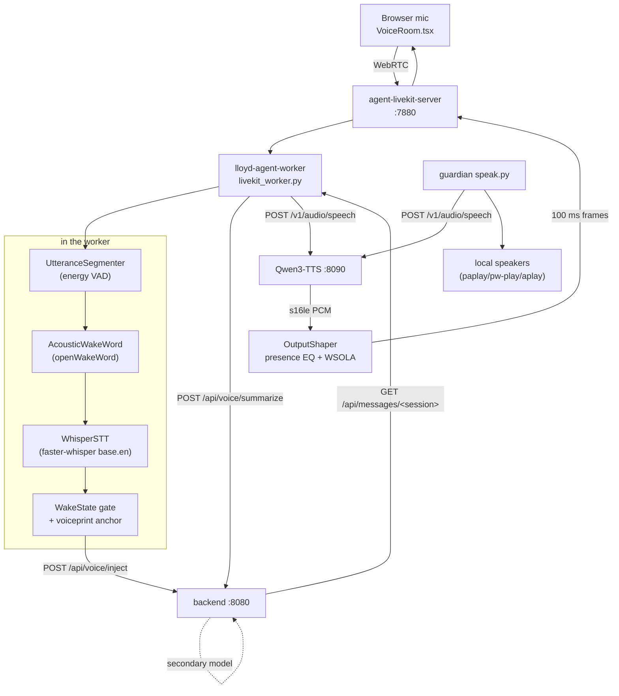

# Voice

Talking to Lloyd out loud, and Lloyd talking back. This is the whole round
trip in one place: the LiveKit transport, the wake word, ASR, the gate that
decides whether a transcript becomes a turn, the cloned TTS voice, and the two
corrections applied to it on the way out. Where a piece has a setup story — a
model file on disk, a vendored upstream, a secret — that story is here too, and
[[infrastructure]] / `SETUP.md` carry only the pointer.

One agent worker (`lloyd-agent-worker`) sits in a LiveKit room with the
browser, turns what it hears into an ordinary user turn on a chat session, and
speaks the reply back in a voice it corrects client-side.

## The round trip

Five processes, and the browser makes six. Only the hearing and shaping
stages share an address space; every hop between the boxes below is a socket,
which is why each half can be restarted, or break, on its own.

| Process | Port | Role | Launcher |
|---|---|---|---|
| `agent-livekit-server` | 7880 (+7881 TCP, 50000–50100 UDP) | the LiveKit SFU binary. Never reads TTS config | `bin/start-livekit-server.sh` |
| `lloyd-agent-worker` | 8501 (loopback, diag only) | `agent-services/livekit_worker.py` — VAD, wake word, STT, speaker id, TTS shaping | supervisord runs it directly |
| `agent-tts` | 8090 | Qwen3-TTS, OpenAI-shaped `/v1/audio/speech` | `bin/start-qwen3-tts.sh` |
| `lloyd-mc:lloyd-backend` | 8080 | `/api/voice/*`, `/api/livekit/token`, the turn itself | `server.py` |
| `lloyd-mc:lloyd-frontend` | 5173 | Vite: proxies `/api` to the backend and `/livekit` to the SFU | `npm --prefix web run dev` |

Both the worker and the TTS engine are pinned to **GPU 0** (the desktop 3090)
by `CUDA_VISIBLE_DEVICES` in their supervisord programs — see
[[infrastructure]] for why the worker must stay off GPU 1. STT, VAD and the
speaker encoder are all `device: cpu`; the worker's VRAM is a dependency
initialising a CUDA context, not a model.



End to end, one utterance:

1. The browser mints a room-scoped JWT from `POST /api/livekit/token` and joins
   `lloyd-<session_id>` over WebRTC.
2. `WorkerManager` sees a room with a non-agent participant within 2 s and
   opens a `RoomBridge` on it.
3. `UtteranceSegmenter` cuts the incoming frames into utterances on energy.
4. openWakeWord and Whisper run on that utterance **in parallel**; `WakeState`
   decides whether it opens a window, extends one, or is dropped.
5. What survives is POSTed to `/api/voice/inject` as `source="user"`, and from
   there it is an ordinary chat turn — SSE to any open UI, the usual harness.
6. `_poll_session_messages` notices the new assistant message, rewrites it for
   speech on the secondary model, and synthesises it.
7. `OutputShaper` corrects the audio and pushes 100 ms frames onto the
   `lloyd-tts` track; the browser plays it and mutes the mic while it does.

## LiveKit: the transport

### Rooms are sessions

`WorkerManager` polls LiveKit's RoomService every `POLL_INTERVAL` (2 s) and
joins any room whose name starts with `livekit.room_prefix` (`lloyd-`) and
which has a non-agent participant. The room name *is* the routing key: a
`RoomBridge` strips the prefix and treats the remainder as the chat
`session_id`, so `lloyd-20260911_120001_abcd` bridges audio into that session
and nothing else. The browser gets a room-scoped JWT from
`POST /api/livekit/token`, which builds the same name from the same prefix —
the two halves agree because they read one config key, not because anybody
kept them in step.

A bridge is torn down only after `_IDLE_GRACE_SECONDS` (15 s) of zero remote
participants. A participant flickering off and on for a second would otherwise
force an immediate reconnect, and the reconnect is the expensive half.
LiveKit's own `room.empty_timeout` (300 s) then reaps the room itself.

`disconnect` waits up to 8 s on in-flight utterance handlers before dropping
the room, so the last thing said before someone closes the tab still lands in
the session.

### Two URLs, and only one of them is for browsers

`livekit.url` (`ws://127.0.0.1:7880`) is the **worker's** URL and is never
handed to a client. Browsers connect through Vite's `/livekit` proxy, which
terminates TLS and forwards plain ws to loopback — so
`_livekit_url_for_request` builds the client URL from the public host the
browser actually used, reading `X-Forwarded-Host` / `X-Forwarded-Proto` that
Vite sets (`xfwd: true`). An explicit `livekit.client_url` still wins for
setups that need it.

The proxy entry needs `ws: true` or the upgrade dies at the Vite layer with
nothing in the backend's log.

### The ICE address is resolved at boot, and must never be hardcoded

LiveKit binds its media ports to `rtc.node_ip`, and a stale value does not
error — the bind silently fails, no media sockets exist, every ICE negotiation
times out in `wait_pc_connection`, the agent never hears anything, and voice is
simply dead. That is exactly what the 08-22 box migration did: the tailnet
reassigned the host from `100.72.151.100` to `100.105.113.88` and LiveKit went
on advertising an address the machine no longer owned.

So `agent-services/conf/livekit.yaml` carries `node_ip: ${LIVEKIT_NODE_IP}` and
`start-livekit-server.sh` resolves it at every boot — `tailscale ip -4` first,
the default-route source address as a fallback — then renders the template
through `envsubst` into `livekit.yaml.runtime` (chmod 600, gitignored) and
execs the binary against that. It downloads the binary itself on first run
(`LIVEKIT_VERSION`, currently 1.11.0, to `~/.local/bin/livekit-server`).

Pinning the candidate to the Tailscale address is what makes remote voice work
from anywhere on the tailnet. The accepted trade-off is that a LAN client with
no Tailscale cannot use voice at all.

### Tokens and secrets

`POST /api/livekit/token` takes a `session_id`, builds the room name, and mints
a JWT with `room_join`, `can_publish`, `can_subscribe` and `can_publish_data`
scoped to that one room — the data grant is what carries the interrupt button
and `client_info`. Identity defaults to a fresh uuid, and *one browser tab is
one identity*, which the continuation gate then leans on.

`LIVEKIT_API_KEY` / `LIVEKIT_API_SECRET` live in `.env` (gitignored) and reach
config.yaml through `${VAR}` placeholders. The start script parses them out of
`.env` by hand rather than sourcing it — other entries contain spaces and would
not survive `source`. Rotate with `bash scripts/gen-livekit-secrets.sh`; the
backend answers 503 rather than minting an unsigned token when they are absent.

## Hearing

Four stages, and the ordering of the middle two is a latency decision rather
than a logical one.

### Segmentation

`UtteranceSegmenter` is an energy VAD, not Silero: `speech_rms` 0.025,
`min_speech_frames_to_start` 3 to debounce a mic click, `silence_ms` 500 to
close an utterance, `min_utterance_ms` 350 and `max_utterance_ms` 30000 as the
floor and the hard cap. It keeps a `LEAD_IN_MS` (200 ms) ring of pre-speech
audio so the first phoneme is not clipped, and those lead-in samples
deliberately do **not** count toward the `min_voiced_ratio` 0.3 check — they
are the silence kept to protect the onset, and counting them would make every
utterance look less voiced than it is. Drops are logged as `diag-drop` with the
reason.

### The acoustic wake word

`AcousticWakeWord` runs openWakeWord directly on the audio, at
`threshold: 0.4`. It exists because Whisper is unreliable on the wake phrase
specifically — "Lloyd" comes back as "Floyd", "Eloid" or "Alloyed" when said
quietly, and a text-match gate then drops a turn the user definitely addressed
to Lloyd. Audio is resampled to 16 kHz with `resample_poly` and swept in
1280-sample (80 ms) chunks, keeping the max score per model. `predict()`
accumulates confidence across chunks, so the model is `reset()` before each
utterance or the previous one leaks in.

Four ONNX files make it work, and all four **are tracked in this repo** — they
arrive with the clone and there is nothing to install:

```
agent-services/models/wakeword/Lloyd.onnx          # custom-trained
agent-services/models/wakeword/Hey_Lloyd.onnx      # custom-trained
agent-services/models/openwakeword/melspectrogram.onnx   # the shared frontend
agent-services/models/openwakeword/embedding_model.onnx
```

`models_dir` holds the two wake models, `engine_dir` the two openWakeWord
engine models every wake model runs on top of. They are **force-added past**
`agent-services/.gitignore`'s `models/` rule, which is unanchored and would
otherwise also swallow the 311 GB `llm/models/` tree — so if you retrain a wake
word, `git add -f` the new file rather than trying to negate the ignore rule.
Without them, `livekit.acoustic_wake.enabled: true` cannot load and detection
falls back to text matching alone, which is the failure this stage was added to
fix.

The text list (`livekit.wake.words`: `lloyd`, `hey lloyd`, `hi lloyd`,
`okay lloyd`, `hello lloyd`) is the second, independent path — `_strip_wake_word`
matches against the transcript and removes the phrase before injection.

### STT

`WhisperSTT` wraps faster-whisper (`base.en`, cpu, int8). It is constructed
lazily but **eager-loaded in `WorkerManager.run()`**, so the first utterance
does not pay for it; a failed eager load only warns and retries on first use.
Weights download to `~/.cache/huggingface` on first run, which is the only
network dependency in the hearing path.

The decode thresholds are tightened well past the defaults
(`no_speech_threshold` 0.7, `log_prob_threshold` -0.8,
`compression_ratio_threshold` 2.0) because the defaults are tuned for long-form
audio and short utterances make Whisper hallucinate politely — "Thank you.
Thank you. Thank you." on near-silence. `_looks_repetitive` catches what
survives that: any 1- or 2-word phrase repeated four or more times
consecutively drops the whole transcript.

`hotwords_file` (`~/obsidian/hotwords.md`) biases the decoder toward names it
would otherwise mangle — it is an ordinary vault note, so adding a name is an
edit, not a deploy.

PCM is wrapped into an in-memory WAV and handed to faster-whisper's own
`decode_audio` rather than resampled by hand.

### The gate

`WakeState` is IDLE or CONTINUATION. In IDLE an utterance is dropped unless the
wake word fired. A match opens a `continuation_seconds` (6 s) window in which
follow-ups from the locked participant pass through with no wake word, and
every pass-through extends it.

**The wake word is detected in parallel with transcription, and that is worth
the complexity.** On the IDLE path `_handle_utterance` starts the STT task,
then runs openWakeWord while it is in flight; on a match it embeds the speaker,
sets the anchor, opens the window and publishes `wake_state` to the browser
*before* awaiting Whisper. The UI flips to "Listening" off that publish, so
cutting Whisper out of that wait saves ~400 ms of perceived wake-word latency.
Correctness does not depend on it — the transcript is collected immediately
afterwards and decides what, if anything, is injected.

**Identity is checked twice, and the second check is conditional for a
reason.** The LiveKit participant identity is always required to match the lock
(one browser tab, one identity). When a `SpeakerIdentifier` is attached, a
follow-up must *also* clear `anchor_threshold` cosine against the embedding
taken from the wake-word utterance — that is what catches "different person,
same browser tab". But it is applied only when the wake-word utterance matched
an *enrolled* profile. An unknown speaker's anchor is a noisy one-second
embedding, and comparing against it rejects real follow-ups while providing no
meaningful safety, so that case falls back to identity alone. An embedding that
fails outright degrades to identity-only for that turn rather than dropping a
real utterance.

A bare wake word (`skip_inject_if_only_wake_word`) opens the window and injects
nothing. So does a short transcript with no wake-word match when openWakeWord
already fired — that is a mistranscribed "Lloyd", and the right move is to wait
for the follow-up. What does get injected is POSTed to `/api/voice/inject` with
the session key and, when known, the speaker name; the backend prefixes it as
`[Name]: text` and enqueues it as `source="user"` so it streams through the
ordinary turn path and any open chat UI sees it. A payload with no session key
falls back to the legacy `voice-main` catch-all.

Note that the code defaults and the config disagree in two places, and
config.yaml wins: `WakeState.continuation_seconds` defaults to 12.0 against the
configured 6.0, and `RoomBridge.anchor_threshold` defaults to 0.65 against the
configured 0.4. The code defaults are what a worker with no `livekit.wake` /
`livekit.voiceprint` block would use.

### Who is speaking: profiles and enrollment

`agent-services/speaker_id.py` is Resemblyzer — 256-d d-vectors, unit-norm so
cosine is a dot product — and it does two different jobs with one encoder:

- **Enrolled recognition.** `*.npy` files in `livekit.voiceprint.profiles_dir`
  (`~/lloyd/voice_profiles`). `identify()` returns the best profile above
  `profile_threshold` (0.75) or `unknown_label`. That name becomes the
  `[Alan]: …` prefix on the injected turn.
- **Anchor matching** for the continuation window above, against
  `anchor_threshold` (0.4) — a deliberately looser bar, because it is answering
  "same voice as ten seconds ago", not "who is this".

One `SpeakerIdentifier` is shared across every room, so the encoder loads once,
and the encoder itself is lazy — keeping a torch load out of worker startup.

Enrollment is a UI action, not a script: **Settings → Voice profiles** records
a clip in the browser and POSTs it to `/api/voice/speakers/enroll`
(multipart, 16-bit PCM wav, ≥ 1 s, downmixed to mono server-side).
`GET /api/voice/speakers` lists and `DELETE /api/voice/speakers/{name}` removes.
The backend builds its own `SpeakerIdentifier` against the same config keys and
the same directory — it does not talk to the worker — so a new profile is a
file the worker picks up on `reload()`.

`profiles_dir` is empty as of 2026-09-11. With no enrolled profiles every
wake-word utterance is an unknown speaker, which means no name prefix on the
injected turn and continuation gated on LiveKit identity alone. That is the
intended degradation, not a fault.

### The wake-miss capture rig

`WakeMissCapture` keeps a rolling raw-audio ring per room plus recent score
records, and an aiohttp server on `127.0.0.1:8501` exposes `/healthz`,
`/ww_miss` and `/ww_label`. The backend proxies `/api/voice/ww_miss` and
`/api/voice/ww_label` to it. It is for tuning the threshold against real misses
rather than synthetic audio: say the wake word, have it ignored, and flag it
while the audio is still in the ring. On by default
(`livekit.acoustic_wake.diag.enabled`); a port it cannot bind disables the rig
and leaves the worker running.

## Speaking

### Choosing what to say

`RoomBridge._poll_session_messages` watches `GET /api/messages/<session>` every
`SESSION_POLL_INTERVAL` (0.5 s) for new assistant turns. The spoken set is
**seeded with the entire existing history at connect**, so reconnecting to a
live room does not re-speak the conversation so far.

Each candidate goes through `POST /api/voice/summarize` first, which rewrites
it on the **secondary** model into spoken form — the primary's answer is often
long and full of code blocks and tool references, none of which TTS gracefully.
`_is_trivially_speakable` skips the round-trip for short plain prose (under 300
chars, no markdown), because the secondary's prompt would just echo it back and
the call costs 0.5–2 s. A failed or empty summary falls back to the raw text
and says which path it took in the log; `used_summary` on the response is how
the caller can tell.

`TTSStreamer` then POSTs to Qwen3-TTS with `stream: true`,
`response_format: pcm`, publishes one `lloyd-tts` track per room, and pushes
100 ms frames (`FRAME_MS`; the SDK requires a 10 ms multiple). Utterances run
serially through a queue so Lloyd's voice cannot overlap itself when the
harness produces several replies quickly.

`interrupt()` — driven by `{"type": "interrupt"}` on the LiveKit data channel,
which is what the browser's interrupt button sends — drops everything queued,
cancels the in-flight utterance and best-effort calls `source.clear_queue()`.

### The TTS server

`agent-tts` is a **vendored checkout** of
`github.com/groxaxo/Qwen3-TTS-Openai-Fastapi` at
`agent-services/services/tts/qwen3-tts/`, pinned by
`qwen3-tts-upstream-commit.txt` (783bf0e) with `qwen3-tts-local.patch` applied
on top. The subtree is its own git repo and **not** a submodule, so the patch is
what is tracked here, not the tree. Rebuild it with:

```bash
cd ~/lloyd/agent-services/services/tts
git clone https://github.com/groxaxo/Qwen3-TTS-Openai-Fastapi.git qwen3-tts
cd qwen3-tts && git checkout "$(cut -d' ' -f1 ../qwen3-tts-upstream-commit.txt)"
git apply ../qwen3-tts-local.patch
```

and re-export it after any local edit with
`git -C qwen3-tts diff > qwen3-tts-local.patch`. The patch is small and does two
things: it retries `torch.cuda.is_available()` once and logs loudly when it
falls through to CPU (a silent CPU load is a server that works and is
unusably slow), and it pads 200 ms of silence onto the **non-streaming** encode
path. Voice mode never takes that path, which is precisely why
`tail_silence_ms` exists client-side.

It runs from its own venv (`.venvs/qwen3-tts`) under
`TTS_BACKEND=optimized`, with `TTS_CONFIG` pointing at the tree's own
`config.yaml`. `start-qwen3-tts.sh` waits for :8090 to be free rather than
killing whatever holds it — supervisord owns process lifecycle.

**Two models, and which one is default is a latency decision.**
`0.6B-CustomVoice` serves the built-in speakers (Vivian, Ryan);
`1.7B-Base` is the only one that can serve a `clone:` request. `default_model`
is `1.7B-Base` because voice mode always clones — leaving it on CustomVoice made
the first cloned utterance after every restart pay an unload+load+warmup cycle
(~20 s measured, against a normal ~5 s) and churned two 3–4 GB models through
VRAM whenever a built-in voice was requested. Built-in voices still work; they
just trigger the swap on the request that asks for one. Two ordering rules in
that file are load-bearing and commented there: `1.7B-Base` must stay the first
`type: base` entry because `_base_model_key()` returns the first it finds, and
its `hf_id` is an **absolute local path** because the HF cache holds only the
0.6B — a hub id there would pull ~4 GB mid-request on the first cloned
utterance.

The clone protocol is a prefix. `voice: "clone:<profile>"` resolves against
`voice_library/profiles/<profile>/`, and the server switches to the Base model
and answers 404 for a missing profile, 400 for a backend that cannot clone.

### The cloned voice

The voice is **Dave Cullen** (`clone:dave_cullen`), zero-shot ICL cloning on
Qwen3-TTS-12Hz-1.7B-Base. A profile is four files:

| File | What it is |
|---|---|
| `ref.wav` | the reference clip — 17.4 s, 44.1 kHz mono s16le, faded in/out, silence-bounded |
| `ref.lab` | its transcript |
| `meta.json` | `kind`, `ref_text`, `x_vector_only_mode`, language, the source line |
| `provenance.json` | channel, video id, clip offsets, the tool that pulled it |

`x_vector_only_mode: false` means ICL, and **ICL requires `ref_text`** — a
profile with a clip and no transcript is a 400 at synthesis time, not a quiet
degradation.

Provenance, the source clip, and every measurement below live in
`~/obsidian/projects/lloyd/voice/voice-source-dave-cullen.md`. That vault note
is the source of truth for the assets: the profile directory is **untracked and
not reproducible** — the 2026-08-22 rebuild destroyed the original clone because
it lived only in a gitignored tree, and nothing written down at the time even
named the channel. Back it up with the tree; a lost profile means TTS starts
happily and every synthesis request 404s.

Falling back to a built-in voice is a real escape hatch, but **check
`/v1/voices`, not the source** — and verify with a round trip, since a bad voice
name still returns HTTP 200:

```bash
curl -s localhost:8090/v1/voices | jq -r '.voices[].id'
curl -s localhost:8090/v1/audio/speech -H 'content-type: application/json' \
  -d '{"model":"qwen3-tts","voice":"Ryan","input":"test"}' \
  -o /tmp/v.wav -w '%{http_code} %{size_download}\n'
```

### The two corrections the voice needs

Both live in `agent-services/tts_shaping.py`, are pure numpy/scipy with no
LiveKit dependency, and are applied **client-side in the worker** — not in the
TTS server, whose tree is gitignored and which a rebuild would silently revert.

#### Presence: the top is missing, not the bottom

The 12 Hz speech tokenizer rolls off above ~1.5 kHz. Measured against the
clone's own reference clip, with a frame gate keyed on **sub-1 kHz energy**:

| band | output vs the real speaker |
|---|---|
| 100 Hz – 1.5 kHz | within 0.5 dB — already correct |
| 1.5–2.5 kHz | −1.8 dB |
| 2.5–3.5 kHz | −3.2 dB |
| 3.5–5 kHz | −3.9 dB |
| 5–9 kHz | −3.4 to −4.4 dB |
| above 9 kHz | −6.2 dB |

That missing presence band is the "he's in a broom closet" sound — it carries
proximity and consonant detail. Two high shelves put it back, fitted over three
utterances against both reference clips, residual under 1 dB from 300 Hz to
9 kHz:

```yaml
shaping:
  presence_eq: true
  shelves:
    - {freq: 1800, gain_db: 2.75, q: 1.0}
    - {freq: 8000, gain_db: 4.0,  q: 0.7}
```

Three things about this are easy to get wrong, and each was got wrong once:

- **It is the vocoder, not the reference clip.** Every output lands at BOX
  2.6–4.1 whatever the reference, the mode (ICL vs x-vector), the speed or the
  streaming setting; every input reference sits at 1.7–1.8. Re-cutting from a
  second source video made openness *worse*. So the correction belongs on the
  output and there is nothing to fix in the profile.
- **Do not "fix" it by cutting 300 Hz.** The 200–500 Hz over 2–6 kHz *ratio*
  looks wrong, but that band's absolute shape already matches the reference to
  0.1 dB — the ratio is off only because the top is missing. Cutting the
  low-mid fixes the ratio by trading hollow for thin.
- **The metric is the trap.** Gate frames on total RMS and raising the highs
  swaps vowel frames for fricatives inside your own measurement, which reads a
  +9 dB shelf as +24 dB. Gate on sub-1 kHz energy, which the correction cannot
  move.

Measured end to end through the real worker path: BOX 9.22–9.26 → **5.34–5.52**
against the references' 4.01/4.49, and spectral centroid 606–672 Hz →
**769–856 Hz** against 899/788 Hz. Peak grows 0.6–1.6 dB (0.56 → 0.63 full
scale) with zero clipped samples across 360 k. `OutputShaper` counts clipping
rather than letting int16 wrap — a wrapped sample is a full-scale sample of the
opposite sign, i.e. a click — and warns above 0.1% that the shelf gains are too
hot for whatever the server is now sending.

`PresenceEQ.reset` seeds the filter with **zeros, not `sosfilt_zi`**: an
utterance begins from silence, and the steady-state initial condition would
open it with a step transient.

#### Speed: the server drops it, so the worker applies it

`generate_voice_clone_streaming` takes no `speed` parameter while the
non-streaming path applies `librosa.effects.time_stretch`. Voice mode always
streams, so the configured `speed` did nothing at all until 2026-09-06 —
re-confirmed before fixing: same text, streaming, 5.12 s at 1.0, 5.04 s at 0.7,
5.12 s at 0.5, while non-streaming went 5.52 s → 8.23 s.

`WsolaStretch` restores it client-side, and **WSOLA rather than a phase
vocoder** because a phase vocoder adds exactly the smeared, hollow quality the
shelves exist to remove. Time-domain, so pitch survives (180 Hz in → 179.9 Hz
out at 0.7×); the rate error is a fixed ~34 ms tail rather than drift, because
the analysis pointer advances by a fixed hop and the waveform-similarity search
only perturbs *where* each frame is read from. The search radius must exceed
one pitch period of the voice (192 samples at 125 Hz, 24 kHz) or the search
cannot align consecutive frames and WSOLA degrades into plain overlap-add.
TTFB is unchanged within noise (0.24–0.27 s) — it needs ~62 ms of lookahead.

The worker sends `speed: 1.0` on the wire regardless, so the day the server
grows streaming speed support it cannot stretch twice.
`tests/test_tts_output_shaping.py::test_speed_is_not_asked_of_the_server` pins
that.

**Pace is set by ear, and the words-per-second target was wrong.** Dave speaks
2.06 w/s; matching it puts `speed` at 0.70, and hearing it, Alan's verdict was
too slow. The metric misleads because his reference is one deliberate segment
and the model distributes its pauses differently, so equal w/s is not equal
perceived pace. One synthesis stretched to each setting — the honest
comparison, since separate syntheses vary enough that sampling noise reads as
the effect of the knob:

| speed | 0.70 | 0.80 | 0.85 | 0.90 | 1.00 |
|---|---|---|---|---|---|
| w/s | 2.70 | 3.09 | 3.28 | 3.47 | 3.87 |

Every one of those is already faster than 2.06 by that measure, including the
one that sounded too slow. Shipped at 0.85, then raised again on 2026-09-09 in
two +20% steps judged the same way — 0.85 (2.86 w/s) → 1.02 (3.69) →
**1.22 (4.41)**, which is where it sits. Above 1.0 the stretch is
*compressing* the model's own output rather than expanding it, which is the
cheaper direction — no invented material, just a shorter analysis hop — so
there is no quality reason to stop at 1.0. The ceiling is where the similarity
search starts dropping whole pitch periods and consonants smear; 1.22 is well
short of it. **Do not re-derive this number from a w/s match.**

#### Both stages hold state, so both are reset per utterance

Filter state and overlap-add state carry across chunk boundaries — that is what
makes chunking inaudible — which means a missed drain opens the *next*
utterance with the tail of the one the user talked over. `_stream_utterance`
therefore flushes the shaper in a `finally`, because an interrupt cancels that
coroutine mid-stream and the normal drain never runs.
`test_interrupt_does_not_leak_shaper_state_into_the_next_utterance` pins it by
comparing an interrupted shaper against a fresh one.

#### The end of an utterance was being cut off

`_stream_utterance` returns once audio is *queued* at the `AudioSource`, not
played. So `on_utterance_end` fired early, `is_speaking` lied, and anything
calling `interrupt()` → `clear_queue()` discarded speech that had not come out
yet — the last syllable, reliably. Two fixes, and they are complementary:

- **`tail_silence_ms`** (250 ms) appends silence to every utterance, so the
  audio occupying that discarded position is silence rather than the end of a
  word.
- **`_await_playout()`** waits on `AudioSource.wait_for_playout()`, bounded at
  the queue's own duration + 2 s and best-effort, so `is_speaking` and the
  wake-word continuation window describe audio the user has actually heard. A
  room with no subscriber must not wedge the drain loop, and an older SDK
  without the method must not break it.

## The browser half

`web/src/components/VoiceRoom.tsx`, mounted by `VoiceModeContext` when voice
mode is engaged for a session. It publishes the mic, subscribes to the agent's
`lloyd-tts` track, and renders the wake state the worker pushes over the data
channel (`{type: "wake_state", state, remaining_s, continuation_s, speaker}`),
ticking the remaining seconds down locally between pushes.

It is **half-duplex by default**: the mic is muted while the agent track is
above `AGENT_SPEAKING_THRESHOLD` (0.02), which is the cheap way to stop Lloyd
transcribing himself.

The mic is not published straight from `getUserMedia`. The capture chain is
built by hand so a per-client `GainNode` can sit between the microphone and
LiveKit, with the processed stream wrapped back into a `LocalAudioTrack` tagged
`Track.Source.Microphone` — so `setMicrophoneEnabled(false)` and the
half-duplex mute still find it. The gain is per-device, persisted to
`localStorage` (`web/src/lib/micGain.ts`, 0–4.0, default 1.0) and driven live
from the Settings slider through a subscription, ramped over 50 ms so a drag
does not click. It runs *in series with* the browser's own AEC/NS/AGC rather
than replacing them.

`?raw_audio=1` is a diagnostic that disables the browser's WebRTC APM entirely
(EC/NS/AGC off) and is sticky in `localStorage`. It exists for one open
question: phone audio scores ~0.001 on openWakeWord with APM on, and this is
how you A/B whether browser-side processing is responsible. `?raw_audio=0`
clears it.

On connect it also sends a `client_info` message carrying the browser's UA,
mobile flag, the audio constraints actually in force and the mic gain, so the
wake-miss rig can correlate misses with a device's DSP configuration.

## The spoken alert channel is separate, deliberately

The guardian says alerts aloud in the same cloned voice —
`agent-services/guardian/speak.py`. [[infrastructure]] covers the six-channel
fan-out it is one of; what matters here is that it is a *different consumer of
the same voice*, and the two must not be coupled.

- **It lives in `agent-services/guardian/`** because `guardian-stage.sh` stages
  `guardian/*.py` and nothing else into the pinned snapshot. A module the
  guardian imports must be in that directory or it will not exist at runtime,
  and the failure would only appear in production.
- **It reports dispatched, not heard.** The unit watchdogs the loop at
  `WatchdogSec=90` against a 5 s tick, so synthesis and playback happen in a
  detached child (`start_new_session=True`) and `dispatch` returns in
  milliseconds. What came out of the speaker is in `voice.log` in the guardian
  state dir.
- **Shaping is a soft dependency that degrades in tiers, and says which tier
  ran.** `speak.shape` imports `tts_shaping.py` *by absolute path* — the worker
  runs with the snapshot dir on `sys.path` and the repo lives elsewhere, and
  putting the whole repo on `sys.path` to reach one module is a bigger door
  than this needs. The EQ needs scipy and the WSOLA speed needs only numpy, so
  a fallback to the system interpreter still fixes the pace. The tier is logged
  because the first cut of this module called `OutputShaper.enabled()` — it is
  a `@property` — and shipped unshaped audio while looking perfectly healthy. A
  silent downgrade is indistinguishable from success.
- **It speaks through the local speakers**, not LiveKit: `paplay`, `pw-play`,
  `aplay` or `ffplay`, whichever exists.
- **What it says is rewritten first.** `speakable()` strips commit hashes,
  paths, arrows and backticks — "Rolled back 1a2b3c4d → 5e6f7a8b" read aloud is
  sixteen letters of noise, and the hash is in the toast, the ledger and the
  journal for anyone who needs it. Removing a hash leaves the preposition that
  pointed at it, so the dangling "Rolled back to" is trimmed too. The hash
  pattern requires at least one `a-f`, or `SM_20260906_a1b2` loses its date and
  every 7-digit number in a body is silently eaten.

### Quiet hours are under `guardian.voice`, not `livekit.tts`

```yaml
guardian:
  voice:
    quiet_hours:
      enabled: true
      start: 23
      end: 7
      allow_critical: false
```

**The split is load-bearing.** `livekit_worker` reads `livekit.tts`, and a
voice conversation that went mute at 23:00 because an alert policy leaked into
it would be a real bug. Only alerts are gated by the hour. `sync-voice-config.py`
reads the quiet-hours block from `guardian.voice` specifically, and
`tests/test_guardian_speak.py::test_sync_pushes_quiet_hours_from_the_guardian_block_not_livekit`
pins that it never comes from the TTS block.

Inside the window only the *sound* is withheld — toast, journal, ledger, vault
note and backlog task all still fire, so nothing is lost, it is waiting in the
morning. That is what makes it safe to default on. `allow_critical: true` lets
a rollback wake you anyway.

The window is checked **before** the repeat suppression, which records as it
decides. Recording a quiet-hours drop would spend the hourly slot on an
utterance nobody heard, and the 08:00 repeat of an 03:00 alert would then stay
silent for the wrong reason. A window that wraps midnight is the normal shape
(`start > end` is handled), and `start == end` means *no* window rather than a
full day of silence.

### Two suppression windows, and `LLOYD_VOICE_ALERTS`

`policy.VOICE_REPEAT_SECONDS` is **3600 s** against
`policy.ALERT_REPEAT_SECONDS`' 900 s, and voice suppression lives **on disk**
(`voice_spoken.json`, under `flock`) rather than in memory. The two producers
are different processes — the guardian daemon and the `lloyd-guardian-nag`
oneshot that fires every 15 minutes — so `guardian.py`'s in-memory
`_alert_seen` cannot see the nag. A toast you have already seen costs a glance;
a sentence you have already heard costs the whole sentence, and at 900 s an
unresolved incident would say the same thing aloud four times an hour
indefinitely. A broken suppression file must not mute the channel, so the
failure path returns True.

`LLOYD_VOICE_ALERTS=0` keeps every other channel and drops only speech.
`tests/conftest.py` sets it for every test — otherwise `pytest tests/` talks to
the room from a process that outlives the test. Voice also sits **below the
`external` gate**, like the vault note and the backlog task: the rollback drill
runs a real guardian against a throwaway repo, and a rehearsal that announces a
rollback out loud is indistinguishable from a production incident to anyone in
the room.

### One source for the voice, pushed rather than pulled

`config.yaml`'s `livekit.tts` is the single source. The guardian runs on the
system interpreter with no yaml module and must not read the repo on a critical
path, so `agent-services/bin/sync-voice-config.py` *pushes* the settings across
at stage time (from `guardian-stage.sh`, best-effort, never blocking staging)
into `voice.json` in the guardian state dir. It copies `api_url`, `model`,
`voice`, `speed`, `sample_rate`, `tail_silence_ms`, the `shaping` block, and
quiet hours from `guardian.voice`.

`speak.py`'s `DEFAULTS` mirror those values so a guardian whose `voice.json`
was never synced still sounds right; the sync only stops the two drifting after
a voice *change*. `load_config` merges one level deep, so a `voice.json` that
moves only `quiet_hours.start` does not silently drop `enabled` and `end`.

## Operating it

### Restarting the right thing for a voice change

Getting this wrong is quiet: the config looks correct, the TTS endpoint happily
clones, and voice mode keeps speaking the old voice.

| Changed | Restart |
|---|---|
| `livekit.tts.voice` / `.speed` / `.shaping` | `lloyd-agent-worker` — it reads `livekit.tts` once, at `TTSStreamer.__init__` |
| the same, for spoken alerts | `systemctl --user restart lloyd-guardian` — re-stages, which re-runs `sync-voice-config.py` |
| TTS model path / `default_model` | `agent-tts` |
| `livekit.stt` / `.vad` / `.wake` / `.acoustic_wake` / `.voiceprint` | `lloyd-agent-worker` |
| `livekit.yaml`, or the host's tailnet address | `agent-livekit-server` — it resolves `node_ip` at boot |

`agent-livekit-server` is the SFU binary and never reads TTS config —
restarting it does nothing for voice. Neither the worker nor the guardian
restart is needed for voice to *work*, only for a change to reach that
consumer.

### What a rebuild has to restore

`SETUP.md` is the authority for the whole machine; these are the voice-specific
assets, and the two untracked ones are the reason the 08-22 rebuild lost the
voice.

| Asset | Tracked? |
|---|---|
| `agent-services/models/{wakeword,openwakeword}/*.onnx` | **yes**, force-added past `models/` |
| `agent-services/services/tts/qwen3-tts-local.patch` + `-upstream-commit.txt` | **yes** |
| `agent-services/conf/livekit.yaml` (template) | **yes** |
| `voice_library/profiles/dave_cullen/` | **no** — back up; not reproducible |
| `qwen3-tts/models/` (4.3 GB of Base weights) | **no** — re-downloadable, slowly |
| `.env` (`LIVEKIT_API_*`) | **no** — regenerate with `gen-livekit-secrets.sh` |
| `~/lloyd/voice_profiles/*.npy` | **no** — re-enroll from Settings |

### Tests

- `tests/test_tts_output_shaping.py` — the shelves lift above 1.5 kHz and leave
  the low-mid alone, EQ and stretch state really carry across chunk boundaries,
  the stretch holds its rate without drifting and does not move pitch, a sample
  split across two chunks survives, a shelf above Nyquist is a passthrough
  rather than an error, and the worker-level properties: tail silence, playout
  wait, `speed: 1.0` on the wire, and no shaper state leaking past an
  interrupt.
- `tests/test_guardian_speak.py` — what it says aloud, cross-process
  suppression, quiet hours (including the midnight wrap and the empty window),
  the shaping tiers, and that a broken voice channel cannot break the alert.

## History

**Until 2026-09-06 the pace and the presence band were both wrong**, and only
one of them was known. `speed` had been configured since the clone shipped and
was inert on the only path voice mode uses; the hollowness was assumed to be a
bad reference clip until it was measured against built-in voices and a second
source video and turned out to be the vocoder.

**Until roughly 2026-08 this was a different system entirely**, and the retired
design is worth recording because its parts still turn up in logs and old
notes. A standalone pipeline lived outside the repo at
`~/Projects/lloyd-services/`: `voice_pipeline.py` (openWakeWord, Silero VAD,
Whisper via onnxruntime-gpu, Resemblyzer speaker ID) and `voice_mode.py` (an
HTTP API on `:8092` with `/v1/status`, `/v1/say`, `/v1/voice/toggle`), plus
`voice_services.py`, a FastMCP server on `:8094` running as `lloyd-voice-mcp`
inside a distrobox. Audio arrived either from a local microphone via
`sounddevice` or from a browser over a `WebSocketAudioServer` on `:8095`, and
recognised transcripts were POSTed to the OpenClaw gateway's `/hooks/wake`
webhook. The frontend was `VoicePanel.tsx` + `useVoiceStream.ts`.

None of that exists now. The gateway and the distrobox are gone; phase 8b
retired the `voice_mode` daemon path — the `:8092` proxy, the
`_VOICE_ACTIVE_SESSION` override, the `_TTS_ENABLED` flag and the
`/api/voice/{status,toggle,say,…}` routes — in favour of the worker calling
`/api/voice/inject` with an explicit session key and publishing TTS as a
LiveKit track. Two pieces survived the move rather than being rewritten:
openWakeWord, now `AcousticWakeWord` inside the worker, and the Resemblyzer
speaker identifier, ported to `agent-services/speaker_id.py` and still carrying
the legacy anchor-matching heuristic. Silero VAD did not survive; the segmenter
is energy-based. The only stale reference left in the tree is a `pkill` line
for `voice_services.py --port 8094` in
`agent-services/bin/cleanup-orphans.sh`, and one stale doc:
`agent-services/docs/voice-mode-integration.md` describes the OpenClaw bridge
and is history, not reference.
