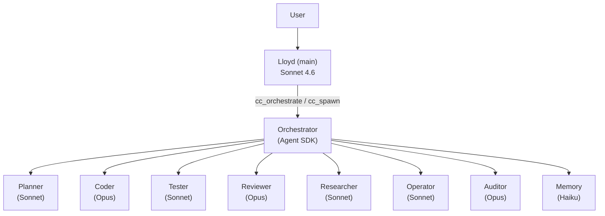

---
tags:
  - lloyd
  - architecture
  - agents
type: reference
segment: projects
---

# Agent System

Lloyd runs on the OpenClaw agent platform with Claude Agent SDK subagent dispatch for sustained work.

## Agent Types

### Main Agent (Lloyd)

| Property | Value |
|----------|-------|
| Agent ID | `main` |
| Model | Claude Sonnet 4.6 (Anthropic Max plan, OAuth) |
| Workspace | `~/obsidian/agents/lloyd/` |
| Role | UI + personal assistant |

**Key workspace files:**

| File | Purpose |
|------|---------|
| SOUL.md | Personality definition |
| AGENTS.md | Behavior rules and delegation policy |
| MEMORY.md | Long-term curated memory |
| USER.md | User context |
| TOOLS.md | Tool usage guide |
| HEARTBEAT.md | Open threads and pending items |
| IDENTITY.md | Core identity |

Lloyd handles conversation, quick lookups, voice responses, and [[backlog]] queries. Delegates sustained work to the Orchestrator.

### Memory Agent

| Property | Value |
|----------|-------|
| Agent ID | `memory` |
| Model | Local Qwen3.5-35B-A3B (periodic), Opus (nightly) |
| Workspace | `~/obsidian/agents/memory/` |
| Role | Session transcript extraction and memory capture |

See [[memory-system]] for the full memory architecture.

### Social Agent

| Property | Value |
|----------|-------|
| Agent ID | `social` |
| Purpose | Discord friend conversations |
| Restrictions | No vault access, no task execution, no file modification |

### Orchestrator (via Claude Agent SDK)

The `agent-orchestrator` extension (`extensions/agent-orchestrator/`) uses the Claude Agent SDK to spawn isolated Claude Code instances as specialist workers. Lloyd dispatches work via `cc_orchestrate` (pipeline) or `cc_spawn` (single agent).

- Workers access tools via MCP bridge to `tool_services.py` (SSE at `http://127.0.0.1:8093/sse`)
- Tools return instance IDs immediately; work runs async; status via `cc_status`/`cc_result`
- Constraint: Agent SDK subagents cannot spawn their own subagents (single nesting)

## Subagent Roster

| Agent | Model | Capabilities | Purpose |
|-------|-------|-------------|---------|
| orchestrator | -- | Pipeline management | Coordinates multi-step tasks |
| coder | Opus | Read/Write/Edit/Bash + vault/backlog MCP | Implementation |
| reviewer | Opus | Read-only | Code review |
| tester | Sonnet | Read/Write/Bash | Testing |
| planner | Sonnet | Read-only + vault MCP | Task breakdown |
| auditor | Opus | Read-only | Security analysis |
| researcher | Sonnet | Read/Web/vault MCP | Research + knowledge capture |
| operator | Sonnet | Read/Write/Bash + backlog MCP | Git, services, CI/CD |
| memory | Haiku | Read + vault MCP | Vault knowledge management |

## Delegation Flow

## Delegation Rules

**Lloyd handles directly:**
- Conversation and quick responses
- Quick file reads
- Memory lookups (vault search)
- [[backlog]] queries
- Daily notes

**Lloyd delegates to Orchestrator:**
- Any code changes
- Research tasks
- Multi-step operations
- Configuration changes

**Hard limits (Lloyd never does):**
- File-modifying bash commands
- Build commands
- Git state changes
- Writes outside `agents/lloyd/`

**Subagent constraints:**
- Sub-agents cannot be spawned directly -- always through the Orchestrator

## Agent Workspaces

- Each subagent has a workspace doc at `~/obsidian/agents/{agent-id}.md`
- Lloyd's workspace is the full `~/obsidian/agents/lloyd/` directory
- Memory agent's workspace: `~/obsidian/agents/memory/`

## Modes

The mode system affects vault search scope, daily notes path, and prefill context.

| Mode | Vault Scope |
|------|-------------|
| Work | work, knowledge, agents |
| Personal | personal, projects, knowledge, agents |
| General | all segments |

Mode switching is handled by the [[mcp-tools|mcp-tools extension]] via `/work`, `/personal`, `/general`, and `/mode` commands.

## Related Docs

- [[index]] — High-Level Architecture
- [[memory-system]] — Memory System (memory agent details)
- [[mcp-tools]] — MCP Tools Server (tool access)
- [[skills]] — Skill System (skill-based procedures)
- [[infrastructure]] — Infrastructure (services and cron)
