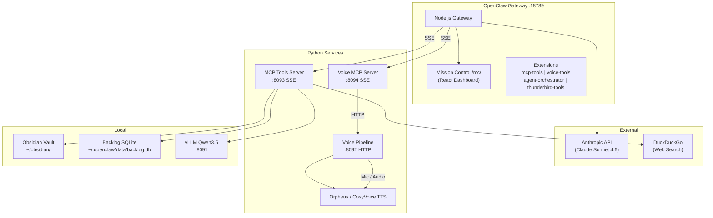

---
tags:
  - lloyd
  - architecture
type: reference
segment: projects
---

# Lloyd — High-Level Architecture Overview

Lloyd is a voice-first AI assistant built on top of **OpenClaw**, a custom gateway/agent platform. The system combines a Node.js gateway, Python tool and voice services, a local LLM, and an Obsidian knowledge vault into a unified personal assistant.

## Core Components

### OpenClaw Gateway
Node.js/TypeScript gateway service running as `openclaw-gateway.service` (systemd user service, port 18789). Runs inside a distrobox container named `lloyd`. Manages agents, sessions, cron jobs, extensions/plugins, and the WebSocket/HTTP API.

### Lloyd (Main Agent)
The primary conversational agent. Model: Claude Sonnet 4.6 via Anthropic (Max plan, OAuth auth). Agent ID: `main`. Workspace: `~/obsidian/agents/lloyd/`. Personality defined in SOUL.md, behavior rules in AGENTS.md. See [[agent-system]] for full agent architecture.

### MCP Tools Server
Python (FastMCP) server at `~/Projects/lloyd-services/tool_services.py`. Runs as `lloyd-tool-mcp.service` (systemd), exposed on port 8093 via SSE. Provides 27+ tools across vault/memory, web, file system, bash, and backlog categories. See [[mcp-tools]] for the full tool inventory.

### Voice Pipeline
Python voice processing at `~/Projects/lloyd-services/`. Includes `voice_pipeline.py` (wake word + VAD + STT + speaker ID), `voice_mode.py` (Textual TUI), `voice_services.py` (voice MCP server on port 8094). See [[voice-pipeline]] for details.

### Mission Control
React dashboard extension at `~/.openclaw/extensions/mission-control/`. Served at `/mc/`. Chat interface, token usage stats, API monitoring, services tab. See [[infrastructure]] for build and deployment details.

### Obsidian Vault
Knowledge base at `~/obsidian/`. 5 segments: `agents/`, `personal/`, `work/`, `projects/`, `knowledge/`. Indexed by BM25 FTS5 for search.

### Backlog System
SQLite-based kanban at `~/.openclaw/data/backlog.db`. Tasks flow: inbox -> up_next -> in_progress -> in_review -> done. See [[backlog]] for details.

### Memory System
3-tier architecture: periodic capture (local Qwen3.5, every 15m), nightly reflection (Opus, 2am PST), SOUL.md/AGENTS.md auto-updates. See [[memory-system]] for the full breakdown.

### Local LLM
vLLM serving Qwen3.5-35B-A3B on port 8091 (~160 tps). Used for periodic memory capture and ASR cleaning.

## Component Diagram

## Key Paths

| Path | Purpose |
|------|---------|
| `~/Projects/lloyd-services/` | Voice pipeline + MCP servers (Python) |
| `~/.openclaw/` | Gateway config, extensions, data, sessions |
| `~/.openclaw/extensions/` | Plugins: mcp-tools, voice-tools, mission-control |
| `~/obsidian/` | Knowledge vault |
| `~/obsidian/agents/lloyd/` | Lloyd's workspace (SOUL.md, AGENTS.md, MEMORY.md, skills/) |

## Related Docs

- [[memory-system]] — Memory System Architecture
- [[mcp-tools]] — MCP Tools Server
- [[voice-pipeline]] — Voice Pipeline
- [[agent-system]] — Agent System
- [[skills]] — Skill System
- [[infrastructure]] — Infrastructure
- [[backlog]] — Backlog System
