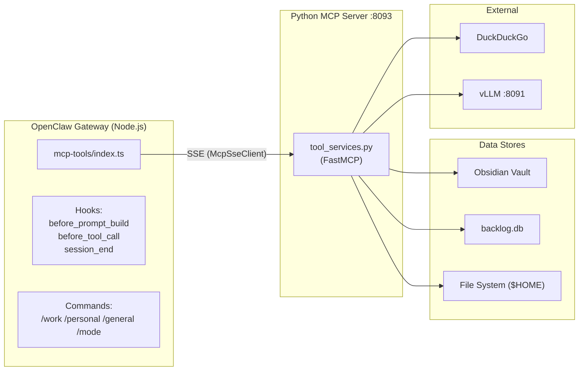

---
tags:
  - lloyd
  - architecture
  - mcp
  - tools
type: reference
segment: projects
---

# MCP Tools Server

The MCP Tools Server is a consolidated Python service providing 28 tools to the [[index|OpenClaw Gateway]] via SSE transport.

## Server

- **Source:** `~/Projects/lloyd-services/tool_services.py`
- **Framework:** Python, FastMCP
- **Service:** `lloyd-tool-mcp.service` (systemd user service)
- **Port:** 8093 (SSE transport)
- **Architecture:** Single consolidated server replacing 5 separate per-plugin `server.py` processes
- **Dependencies:** mcp[cli], pyyaml, ddgs, httpx, readability-lxml, html2text, uvicorn, starlette, sse-starlette

## OpenClaw Plugin

- **Path:** `~/.openclaw/extensions/mcp-tools/`
- **Implementation:** `index.ts` registers 25 tools + prefill hook + work mode commands
- **Transport:** Uses `McpSseClient` to proxy tool calls to the Python MCP server
- **Additional responsibilities:**
  - Mode switching (`/work`, `/personal`, `/general`, `/mode` commands)
  - Daily memory file creation on `session_end` hook
  - Mode-aware scope injection via `before_tool_call` hook

## Tool Inventory (28 Tools)

### Memory / Vault (6)

| Tool | Description |
|------|-------------|
| `tag_search` | Search vault by tags |
| `tag_explore` | Explore tag relationships |
| `vault_overview` | Vault structure overview |
| `mem_search` | BM25 FTS5 full-text search |
| `mem_get` | Read vault file by path |
| `mem_write` | Write to vault file |

### Prefill (1)

| Tool | Description |
|------|-------------|
| `prefill_context` | Tag match + BM25 + GLM keywords for context injection |

### Web (3)

| Tool | Description |
|------|-------------|
| `http_search` | DuckDuckGo web search |
| `http_fetch` | Fetch URL with readability extraction |
| `http_request` | Raw HTTP request |

### File System (6)

| Tool | Description |
|------|-------------|
| `file_read` | Read file contents |
| `file_write` | Write file contents |
| `file_edit` | Edit file with string replacement |
| `file_patch` | Apply patch to file |
| `file_glob` | Find files by glob pattern |
| `file_grep` | Search file contents with regex |

All file operations are sandboxed to `$HOME`.

### System (3)

| Tool | Description |
|------|-------------|
| `run_bash` | Shell command execution (120s timeout) |
| `bg_exec` | Background process execution (long-running) |
| `bg_process` | Background process management |

### Backlog (6)

| Tool | Description |
|------|-------------|
| `backlog_boards` | List all boards |
| `backlog_tasks` | List/filter tasks |
| `backlog_next_task` | Get highest-priority assigned up_next task |
| `backlog_get_task` | Full task details by ID |
| `backlog_update_task` | Update task status, priority, notes |
| `backlog_create_task` | Create new task |

See [[backlog]] for the backlog system architecture.

### Skills (3)

| Tool | Description |
|------|-------------|
| `skills_search` | Search local + ClawhHub catalog skills |
| `skills_get` | Get skill content (local or `clawhub:<slug>`) |
| `skills_install` | Install ClawhHub skill with security validation |

See [[skills]] for the skill system.

## Architecture

## Key Behaviors

- **Mode-aware scoping:** The `before_tool_call` hook injects the active mode's vault scope into search tools automatically
- **Backlog access:** Uses SQLite with a Python threading lock for thread safety
- **File sandboxing:** All file operations restricted to `$HOME`
- **Bash execution:** `run_bash` has a 120s timeout; use `bg_exec` for long-running processes

## Related Docs

- [[index]] — High-Level Architecture
- [[memory-system]] — Memory System (prefill pipeline, vault search)
- [[voice-pipeline]] — Voice Pipeline (voice MCP is a separate server)
- [[backlog]] — Backlog System
- [[skills]] — Skill System
- [[infrastructure]] — Infrastructure (service configuration)
