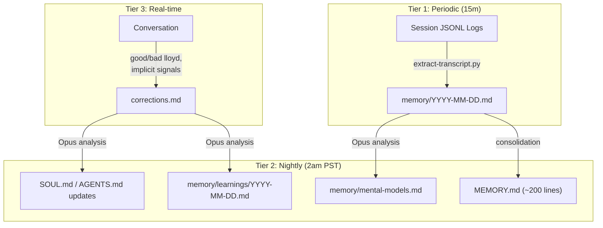

---
tags:
  - lloyd
  - architecture
  - memory
type: reference
segment: projects
---

# Memory System Architecture

Lloyd uses a 3-tier memory architecture that combines automated capture, deep nightly analysis, and real-time behavioral signal detection. The system writes to and reads from the [[index|Obsidian Vault]].

## Tier 1: Periodic Capture

Automated session transcript extraction running every 15 minutes.

- **Cron job:** `periodic-memory-capture` (ID: `06a1d2b2`), every 15 minutes
- **Agent:** OpenClaw `memory` agent backed by local Qwen3.5-35B-A3B
- **Agent workspace:** `~/obsidian/agents/memory/`
- **Script:** `~/obsidian/agents/memory/scripts/extract-transcript.py`
- **Input:** JSONL session logs from `~/.openclaw/agents/main/sessions/`
- **Processing:** Filters to user/assistant text, strips thinking blocks and tool calls
- **State watermark:** `~/obsidian/agents/memory/state.json` (tracks last-processed position)
- **Output:** `~/obsidian/agents/lloyd/memory/YYYY-MM-DD.md` (daily notes with Mission Control session deep-links)

## Tier 2: Nightly Reflection

Deep analysis using Opus model, running at 2am PST.

- **Cron job:** `nightly-reflection` (ID: `9de0e564`), daily at 2am PST
- **Model:** Opus (via Anthropic API)
- **Three tasks:**

### 1. Self-Improvement
Reviews `corrections.md` (positive/negative behavioral signals). Applies changes to SOUL.md and AGENTS.md. Logs modifications to `memory/learnings/YYYY-MM-DD.md`.

### 2. Mental Models
Analyzes conversation patterns. Updates `memory/mental-models.md` with observations about Alan's reasoning and communication style.

### 3. MEMORY.md Consolidation
Distills daily notes into long-term memory. Keeps `MEMORY.md` under 200 lines by summarizing and pruning older entries.

## Tier 3: Real-time Signal Detection

Lloyd detects corrections during live conversation.

- **Explicit signals:** "bad lloyd" / "good lloyd"
- **Implicit signals:** "actually...", "perfect", "no that's wrong", etc.
- **Output:** Logged to `memory/corrections.md` with signal type (positive/negative), category, and status
- **Processing:** Accumulated signals are processed during nightly reflection (Tier 2)

## Memory Flow

## Key Files

| File | Purpose |
|------|---------|
| `agents/lloyd/MEMORY.md` | Long-term curated memory (~200 lines max) |
| `agents/lloyd/memory/YYYY-MM-DD.md` | Daily notes (periodic capture output) |
| `agents/lloyd/memory/personal/YYYY-MM-DD.md` | Personal mode daily notes |
| `agents/lloyd/memory/work/YYYY-MM-DD.md` | Work mode daily notes |
| `agents/lloyd/memory/corrections.md` | Behavioral signal log |
| `agents/lloyd/memory/mental-models.md` | Alan's reasoning patterns |
| `agents/lloyd/memory/learnings/YYYY-MM-DD.md` | SOUL.md/AGENTS.md change log |
| `agents/lloyd/memory/heartbeat-state.json` | Heartbeat timestamps |
| `agents/memory/state.json` | Periodic capture watermark |

## Vault Search

The vault is searchable through multiple mechanisms:

- **BM25 FTS5 full-text search** via `mem_search` tool (no vector/semantic search -- pure BM25)
- **Tag-based search** via memory-graph plugin: `tag_search`, `tag_explore`, `vault_overview`
- **5 vault segments** with scope filtering: agents, personal, work, projects, knowledge
- **Mode system** (work/personal/general) auto-scopes searches

## Prefill Pipeline (Context Injection)

Automated context injection via the `before_prompt_build` hook in the [[mcp-tools|mcp-tools extension]].

- **Turn 1:** Injects yesterday's + today's daily notes + active mode tag
- **Turn 2:** Semantic prefill using turn-1 query as search input via `prefill_context`
- **Turn 3+:** No prefill (conversation history carries context)
- **Context profiles:** chat, memory, code, research, ops, voice, heartbeat
- **Automated prompts** (heartbeat, cron) skip prefill entirely
- **`prefill_context` tool:** Uses BM25 + tag matching + GLM keywords

## Related Docs

- [[index]] — High-Level Architecture
- [[mcp-tools]] — MCP Tools Server (tool implementations)
- [[agent-system]] — Agent System (memory agent details)
- [[infrastructure]] — Infrastructure (cron system)
