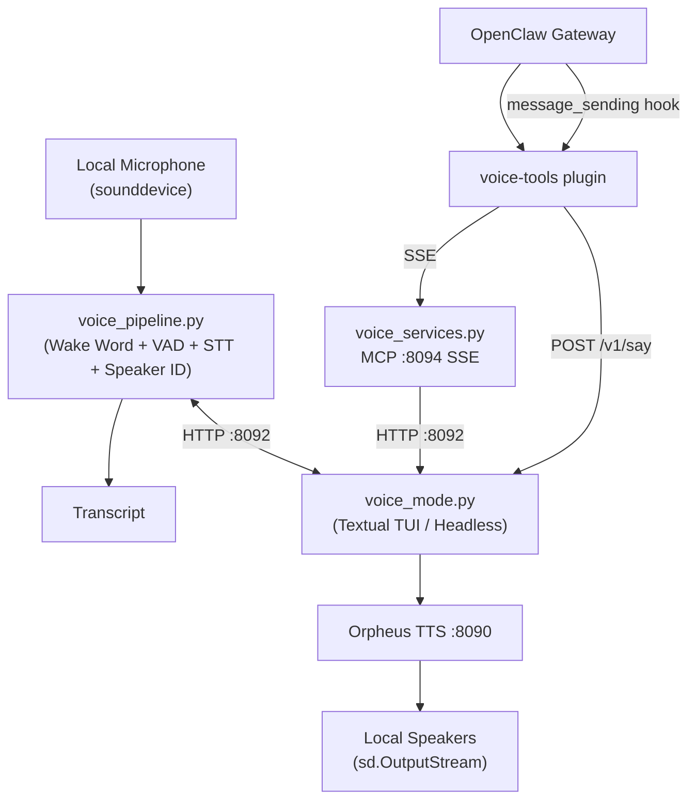
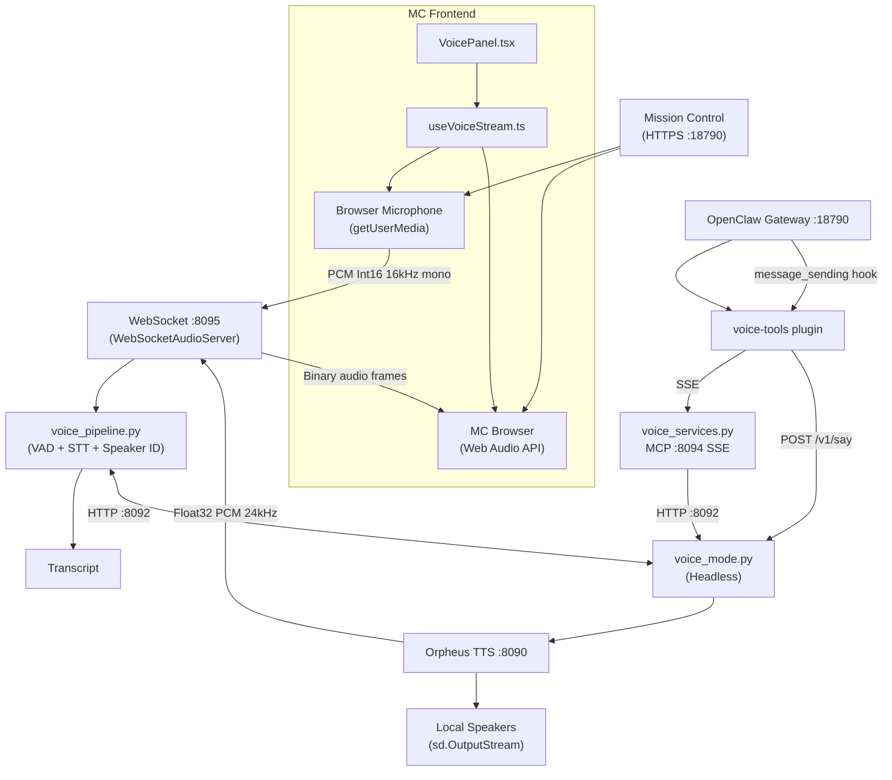

---
tags:
  - lloyd
  - architecture
  - voice
  - stt
  - tts
  - mission-control
  - websocket
type: reference
segment: projects
updated: 2026-03-07
---

# Voice Pipeline

Self-contained voice processing pipeline for wake word detection, speech recognition, text-to-speech, and speaker identification. All source code lives at `~/Projects/lloyd-services/`.

Supports two input modes: **local microphone** (default) and **browser WebSocket** (Mission Control).

## Architecture — Local Mic Mode (`input_mode: local`)



## Architecture — Browser WebSocket Mode (`input_mode: websocket`)



### WebSocket Protocol (port 8095)

Bidirectional WebSocket between MC browser and voice pipeline.

**Browser → Server:**
| Type | Format | Content |
|------|--------|---------|
| Audio frames | Binary | Raw PCM Int16, 16kHz mono |
| Control | JSON text | `{"type": "start"}`, `{"type": "stop"}` |

**Server → Browser:**
| Type | Format | Content |
|------|--------|---------|
| State change | JSON text | `{"type": "state", "state": "LISTENING"}` |
| Transcript | JSON text | `{"type": "transcript", "text": "...", "speaker": "...", "is_continuity": false}` |
| TTS start | JSON text | `{"type": "tts_start", "sample_rate": 24000}` |
| TTS audio | Binary | Float32 PCM chunks at indicated sample rate |
| TTS end | JSON text | `{"type": "tts_end"}` |

### Browser Audio Processing

1. `getUserMedia({ audio: true })` captures mic at native rate (usually 48kHz)
2. ScriptProcessorNode resamples to 16kHz via linear interpolation
3. Float32 → Int16 conversion
4. Binary frames sent over WebSocket
5. TTS playback via Web Audio API `AudioBufferSourceNode` scheduling

### Key Differences from Local Mode

| Aspect | Local | WebSocket |
|--------|-------|-----------|
| Wake word | openWakeWord detection | Skipped (browser toggle) |
| Mic source | sounddevice (`_SafeMicStream`) | WebSocket binary frames |
| Audio reader | `_AudioReader` (sd.InputStream) | `_WebSocketAudioReader` (queue) |
| TTS output | Local speakers only | Local speakers + browser (dual) |
| Resampling | Pipeline-side if needed | Browser-side (48→16kHz) |

## Input Mode Configuration

Set in `voice_bridge_config.json`:

```json
{
    "input_mode": "websocket",  // "local" (default) or "websocket"
    ...
}
```

When `input_mode: "websocket"`:
- `WebSocketAudioServer` starts on port 8095 (bound to 127.0.0.1)
- Single client connection at a time
- Pipeline uses `_WebSocketAudioReader` instead of `_AudioReader`
- Wake word detection is skipped
- VAD + STT + Speaker ID still run on received audio

## Components

### voice_pipeline.py — Core Pipeline

The main audio processing pipeline.

- **Wake word detection:** openWakeWord (custom-trained "Hey Lloyd" / "Lloyd")
- **VAD:** Silero VAD (512-sample frames at 16kHz)
- **STT/ASR:** Moonshine speech-to-text
- **Speaker identification:** Resemblyzer + enrolled voice profiles
- **Pipeline states:** IDLE → LISTENING → PROCESSING → IDLE (+ SPEAKING for TTS)
- **Wakeword ring buffer:** 3 seconds of audio
- **Silence detection:** 1000ms threshold
- **Minimum utterance:** 0.3 seconds
- **GPU:** ONNX Runtime with CUDA support (pre-loads NVIDIA CUDA 12 libs)

#### Audio Reader Abstraction

Pipeline functions accept a `reader_factory` parameter for swappable audio sources:
- `_AudioReader` — wraps `_SafeMicStream` (sounddevice callback API, avoids Pa_ReadStream heap corruption)
- `_WebSocketAudioReader` — pulls frames from `WebSocketAudioServer.frame_queue`

Both implement: `read(timeout) -> np.ndarray | None`, context manager protocol.

#### WebSocketAudioServer

- Runs in a background thread with its own asyncio event loop
- `send_message(dict)` — thread-safe JSON push to browser
- `send_binary(bytes)` — thread-safe binary push (TTS audio)
- `make_reader()` — creates a `_WebSocketAudioReader` (drains stale frames first)
- `has_client` — whether a browser is connected

### voice_mode.py — Voice TUI / Headless Service

Terminal UI (Textual) or headless mode. Exposes HTTP API on port 8092.

| Endpoint | Method | Purpose |
|----------|--------|---------|
| `/v1/status` | GET | Pipeline state, last transcript, speakers |
| `/v1/say` | POST | TTS playback (local speakers + browser if connected) |
| `/v1/voice/toggle` | POST | Enable/disable voice |
| `/v1/voice/ws-status` | GET | WebSocket input mode status and port |

### voice_services.py — Voice MCP Server

- **Framework:** FastMCP on port 8094 (SSE transport)
- **Service:** `lloyd-voice-mcp.service` (systemd user service)
- **Role:** Proxies tool calls to the voice HTTP API (port 8092)
- **Tools:** `voice_status`, `voice_last_utterance`, `voice_enroll_speaker`, `voice_list_speakers`
- **Additional features:** ASR cleaning (LLM-powered via local Qwen3.5), wakeword threshold tuning

### voice-tools Plugin (OpenClaw Extension)

- **Path:** `~/.openclaw/extensions/voice-tools/index.ts`
- **Registers:** 3 tools + `message_sending` hook
- **TTS hook:** Extracts `<summary>` tags from LLM responses, POSTs to `/v1/say` for spoken output, strips tags from display text
- **Tools:** `voice_last_utterance`, `voice_enroll_speaker`, `voice_list_speakers`

### Mission Control Frontend (Browser Voice)

- **VoicePanel.tsx** — Mic toggle button, pipeline state indicator, transcript feed, speaking indicator
- **useVoiceStream.ts** — React hook: getUserMedia, resampling, WebSocket client, TTS audio playback
- **Sidebar.tsx** — Pulsing green mic icon when voice mode active
- **HTTPS required** — self-signed cert at `~/.openclaw/certs/mc.{crt,key}`
- **Voice status proxy:** `/api/mc/voice-status` → `http://127.0.0.1:8092/v1/status`
- **Cert download:** `/api/mc/cert` serves the CA cert for browser installation

## Port Map

| Port | Service | Protocol |
|------|---------|----------|
| 8090 | Orpheus TTS | HTTP |
| 8091 | Local LLM (llama-server) | HTTP |
| 8092 | Voice HTTP API (voice_mode.py) | HTTP |
| 8093 | Tool Services MCP | SSE |
| 8094 | Voice MCP (voice_services.py) | SSE |
| 8095 | Voice WebSocket Audio | WS |
| 8096 | Discord Voice Bridge HTTP (planned) | HTTP |
| 18790 | OpenClaw Gateway + MC | HTTPS |

## TTS Engines

### Orpheus TTS (Primary)
- Server: `~/Projects/lloyd-services/services/tts/orpheus_server.py`
- Port: 8090
- Sample rate: 24000 Hz
- Output: Float32 PCM (streaming chunks)
- Supports emotive tags: `<laugh>`, `<sigh>`, `<chuckle>`, etc.

### CosyVoice (Alternative)
- Server: `~/Projects/lloyd-services/services/tts/cosyvoice_server.py`
- Runs in a separate venv

## ASR Notes

- **Known transcription quirks:** "Alfie" transcribes as "LP" or "alve", "Stewart" transcribes as "Stuart"
- **ASR cleaning:** Uses local LLM + domain vocabulary from vault `tags.md`
- **Domain vocab path:** `~/obsidian/tags.md`

## Related Docs

- [[index]] — High-Level Architecture
- [[mcp-tools]] — MCP Tools Server (separate from voice MCP)
- [[infrastructure]] — Infrastructure (systemd services, ports)
- [[skills]] — Skill System (voice-mode skill)
- [[discord-voice-integration]] — Discord voice channel integration gameplan
